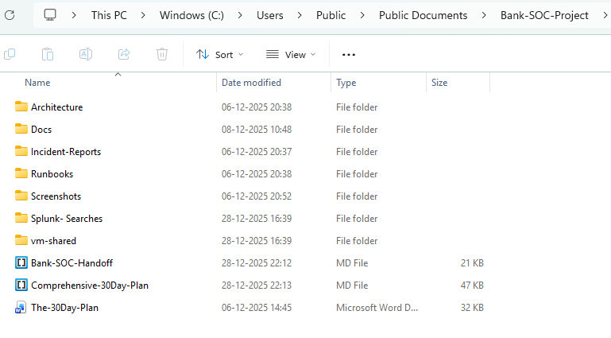
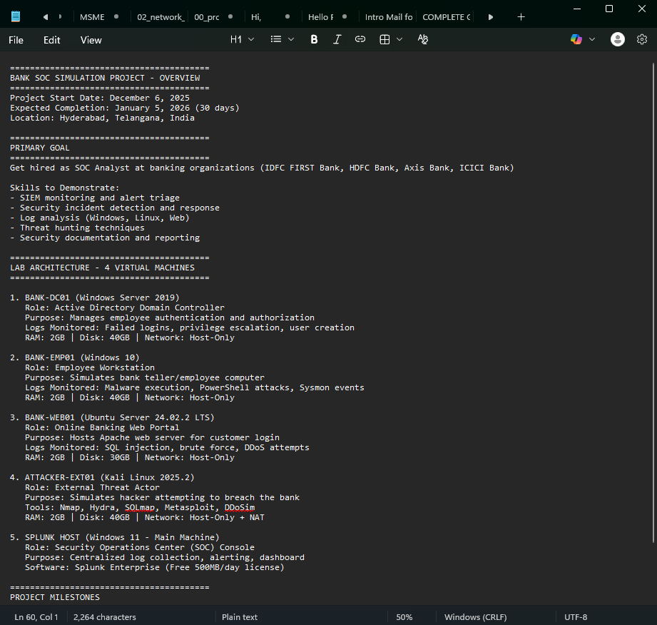
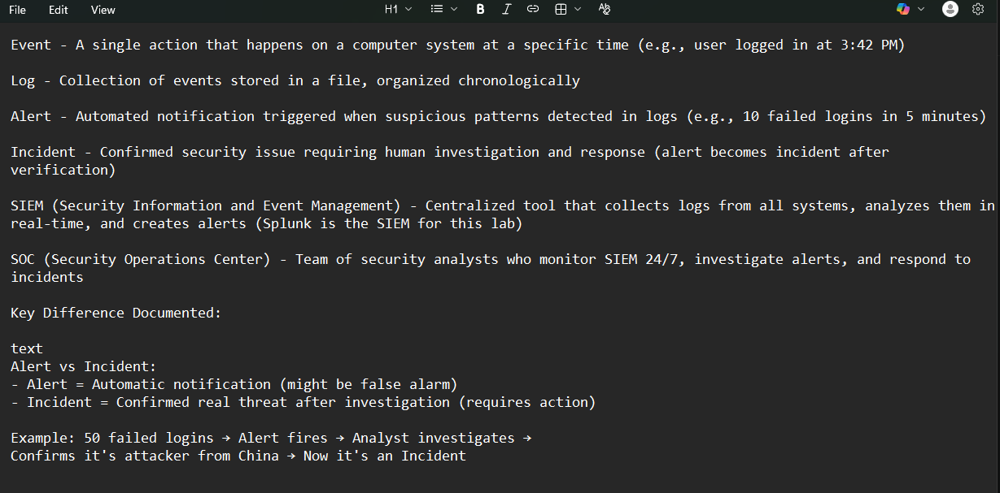

# Day 01 - Project Setup & SOC Fundamentals

## 🎯 Objective
Established professional project structure and documented fundamental SOC concepts to prepare for building a complete Bank SOC simulation lab.

## 🏦 Banking SOC Context
Real bank SOC teams maintain structured documentation, standardized folder hierarchies, and clear concept definitions to ensure consistent operations across 24/7 shifts and compliance audits.

---

## 📋 Tasks Completed

### Task 1: Create Project Folder Structure

**What We Did:**
- Created organized directory structure on host machine (Windows 11)
- Established folders for documentation, incident reports, Splunk queries, runbooks, architecture diagrams, and screenshots
- Added shared folder for VM-to-host file transfers

**Commands/Configuration:**
```cmd
# Executed on Host Machine (Windows 11)
# Navigate to C:\
cd C:\

# Create main project folder
mkdir Bank-SOC-Project

# Create subfolders
cd Bank-SOC-Project
mkdir docs
mkdir incident-reports
mkdir splunk-searches
mkdir runbooks
mkdir architecture
mkdir screenshots
mkdir vm-shared

Result:
Successfully created complete folder structure:

text
C:\Bank-SOC-Project\
├── docs\
├── incident-reports\
├── splunk-searches\
├── runbooks\
├── architecture\
├── screenshots\
└── vm-shared\

**Result:**
Successfully created complete folder structure:



✅ Task 1 Complete

Task 2: Create Project Overview Documentation
What We Did:

Created 00_project_overview.txt in docs\ folder

Documented project goals, target job requirements, lab architecture, and technical specifications

Files Created/Modified:

File: C:\Bank-SOC-Project\docs\00_project_overview.txt

Purpose: Central reference document containing project objectives, VM roles, network configuration, and milestone tracking

Content Created:
========================================
BANK SOC SIMULATION PROJECT - OVERVIEW
========================================
Project Start Date: December 6, 2025
Expected Completion: January 5, 2026 (30 days)
Location: Hyderabad, Telangana, India

========================================
PRIMARY GOAL
========================================
Get hired as SOC Analyst at banking organizations (IDFC FIRST Bank, HDFC Bank, Axis Bank, ICICI Bank)

Skills to Demonstrate:
- SIEM monitoring and alert triage
- Security incident detection and response
- Log analysis (Windows, Linux, Web)
- Threat hunting techniques
- Security documentation and reporting

========================================
LAB ARCHITECTURE - 4 VIRTUAL MACHINES
========================================

1. BANK-DC01 (Windows Server 2019)
   Role: Active Directory Domain Controller
   Purpose: Manages employee authentication and authorization
   Logs Monitored: Failed logins, privilege escalation, user creation
   RAM: 2GB | Disk: 40GB | Network: Host-Only

2. BANK-EMP01 (Windows 10)
   Role: Employee Workstation
   Purpose: Simulates bank teller/employee computer
   Logs Monitored: Malware execution, PowerShell attacks, Sysmon events
   RAM: 2GB | Disk: 40GB | Network: Host-Only

3. BANK-WEB01 (Ubuntu Server 24.02.2 LTS)
   Role: Online Banking Web Portal
   Purpose: Hosts Apache web server for customer login
   Logs Monitored: SQL injection, brute force, DDoS attempts
   RAM: 2GB | Disk: 30GB | Network: Host-Only

4. ATTACKER-EXT01 (Kali Linux 2025.2)
   Role: External Threat Actor
   Purpose: Simulates hacker attempting to breach the bank
   Tools: Nmap, Hydra, SQLmap, Metasploit, DDoSim
   RAM: 2GB | Disk: 40GB | Network: Host-Only + NAT

5. SPLUNK HOST (Windows 11 - Main Machine)
   Role: Security Operations Center (SOC) Console
   Purpose: Centralized log collection, alerting, dashboard
   Software: Splunk Enterprise (Free 500MB/day license)

========================================
PROJECT MILESTONES
========================================
Week 1 (Days 1-7): Foundation & Log Collection
Week 2 (Days 8-14): Alerts, Attacks & Incident Response
Week 3 (Days 15-21): Advanced Threats & Threat Hunting
Week 4 (Days 22-30): Dashboard Optimization & Portfolio Presentation

**Screenshot:**



✅ Task 2 Complete

Task 3: Document SOC Concepts
What We Did:

Created 01_soc_concepts.txt in docs\ folder

Defined 6 fundamental SOC terms in own words with banking-specific examples

Included self-test questions to verify understanding

Files Created/Modified:

File: C:\Bank-SOC-Project\docs\01_soc_concepts.txt

Purpose: Personal reference guide for core SOC terminology with practical banking context

Concepts Documented:

Event - A single action that happens on a computer system at a specific time (e.g., user logged in at 3:42 PM)

Log - Collection of events stored in a file, organized chronologically

Alert - Automated notification triggered when suspicious patterns detected in logs (e.g., 10 failed logins in 5 minutes)

Incident - Confirmed security issue requiring human investigation and response (alert becomes incident after verification)

SIEM (Security Information and Event Management) - Centralized tool that collects logs from all systems, analyzes them in real-time, and creates alerts (Splunk is the SIEM for this lab)

SOC (Security Operations Center) - Team of security analysts who monitor SIEM 24/7, investigate alerts, and respond to incidents

Key Difference Documented:
Alert vs Incident:
- Alert = Automatic notification (might be false alarm)
- Incident = Confirmed real threat after investigation (requires action)

Example: 50 failed logins → Alert fires → Analyst investigates → 
Confirms it's attacker from China → Now it's an Incident
creenshot Evidence:

**Screenshot:**



✅ Task 3 Complete

Technical Details
VMs Used:

None (Day 1 focused on host machine setup only)

Tools/Technologies:

Windows 11: Host operating system - Used for project folder creation and documentation

Notepad: Text editor - Used to create .txt documentation files

File Explorer: File management - Created and organized directory structure

Network Configuration:

No network configuration on Day 1

Network planning documented in project overview for future implementation

Files Created/Modified:

| File Path                                        | Purpose                                                        |
| ------------------------------------------------ | -------------------------------------------------------------- |
| C:\\Bank-SOC-Project\\docs\\00_project_overview.txt | Central project reference with goals, architecture, milestones |
| C:\\Bank-SOC-Project\\docs\\01_soc_concepts.txt  | SOC terminology definitions with banking context               |

Key Data Created
CRITICAL - Future threads will need these exact values:

Project Structure
Project Root: C:\Bank-SOC-Project\

Documentation Folder: C:\Bank-SOC-Project\docs\

Shared Folder: C:\Bank-SOC-Project\vm-shared\ (for VM file transfers)

Planned Network Configuration
(To be implemented in Day 2)

Host IP: 192.168.56.1

VM IP Range: 192.168.56.0/24

Network Type: VirtualBox Host-Only Adapter

Planned VM IPs
(To be configured in Days 2-4)

BANK-DC01: 192.168.56.10

BANK-EMP01: 192.168.56.11

BANK-WEB01: 192.168.56.12

ATTACKER-EXT01: 192.168.56.13
