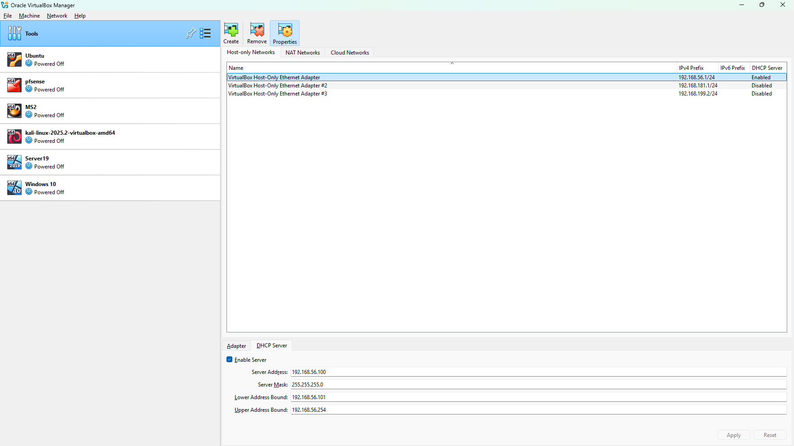
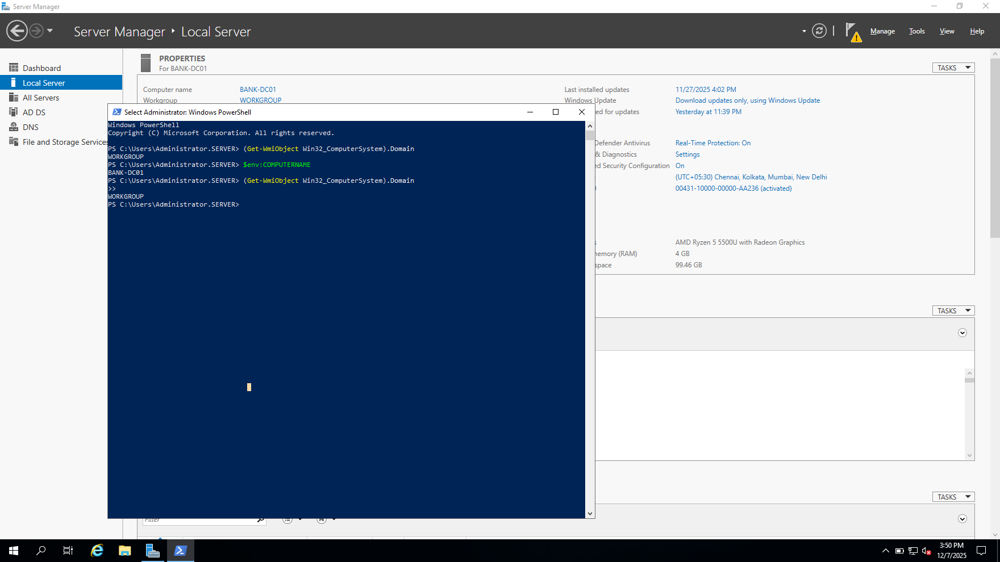
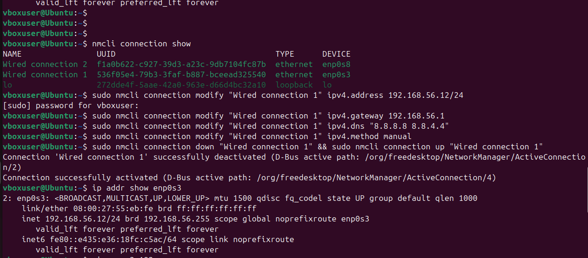
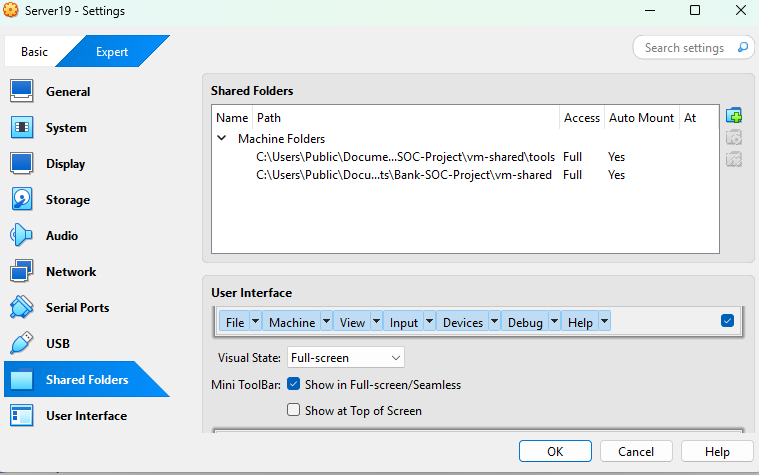

# Day 02 - Network Configuration & VM Networking

## 🎯 Objective
Configured VirtualBox Host-Only networking, assigned static IP addresses to all 4 VMs, and verified bidirectional connectivity between host and all virtual machines.

## 🏦 Banking SOC Context
Enterprise SOC environments require stable, predictable network configurations for reliable log collection and monitoring - IP address changes would break Splunk forwarder connections and disrupt 24/7 security operations.

---

## 📋 Tasks Completed

### Task 1: Create VirtualBox Host-Only Network

**What We Did:**
- Created dedicated internal network (192.168.56.0/24) for SOC lab
- Configured DHCP server for initial IP assignment
- Set host machine as gateway (192.168.56.1)

**Configuration Steps:**
1. VirtualBox → File → Tools → Network Manager
2. Click "Create" button
3. Configure Host-Only Network:
   - IPv4 Address: 192.168.56.1
   - IPv4 Network Mask: 255.255.255.0
   - DHCP Server: Enabled
   - Server Address: 192.168.56.100
   - Lower Address Bound: 192.168.56.101
   - Upper Address Bound: 192.168.56.254
4. Click "Apply"

**Result:**
- Host-Only network created successfully
- Network adapter named "VirtualBox Host-Only Ethernet Adapter"
- Host IP configured as 192.168.56.1/24



✅ **Task 1 Complete**

---

### Task 2: Configure Dual Network Adapters for All VMs

**What We Did:**
- Configured Adapter 1 (Host-Only) for internal lab communication
- Configured Adapter 2 (NAT) for internet access (downloading tools)
- Applied to all 4 VMs: BANK-DC01, BANK-EMP01, BANK-WEB01, ATTACKER-EXT01

**Configuration for Each VM:**

Right-click VM → Settings → Network

Adapter 1:
✓ Enable Network Adapter
Attached to: Host-only Adapter
Name: VirtualBox Host-Only Ethernet Adapter
Adapter Type: Intel PRO/1000 MT Desktop
Promiscuous Mode: Deny

Adapter 2:
✓ Enable Network Adapter
Attached to: NAT

**Result:**
- All VMs configured with dual adapters
- Adapter 1: 192.168.56.x (Host-Only) for lab communication
- Adapter 2: 10.0.2.x or 10.0.3.x (NAT) for internet access

**Why Dual Adapters:**
- **Host-Only:** Stable IPs for Splunk log collection (doesn't change with hotspot/WiFi switches)
- **NAT:** Internet access for downloading Sysmon, Splunk UF, tools (without exposing lab to external network)

✅ **Task 2 Complete**

---

### Task 3: Configure Static IP on Windows Server 2019 (BANK-DC01)

**What We Did:**
- Started BANK-DC01 VM
- Demoted old domain controller (server123.com) from previous training
- Renamed computer to BANK-DC01
- Configured static IP 192.168.56.10 on Host-Only adapter

**Commands/Configuration:**

**Step 1 - Demote Old Domain Controller:**
```powershell
# PowerShell on BANK-DC01
# Check current domain
(Get-WmiObject Win32_ComputerSystem).Domain
# Output: server123.com

# Demote DC using Server Manager:
# Server Manager → Manage → Remove Roles and Features
# → Uncheck "Active Directory Domain Services"
# → Force removal checkbox
# → Set new local admin password
# → Automatic restart

# After restart, verify workgroup:
(Get-WmiObject Win32_ComputerSystem).Domain
# Output: WORKGROUP
```

**Step 2 - Rename Computer:**
```powershell
Rename-Computer -NewName "BANK-DC01" -Restart

# After restart, verify:
$env:COMPUTERNAME
# Output: BANK-DC01
```



**Step 3 - Configure Static IP:**

1. Control Panel → Network and Sharing Center → Change adapter settings
2. Right-click Host-Only adapter → Properties
3. Select "Internet Protocol Version 4 (TCP/IPv4)" → Properties

**Configure:**
```
⦿ Use the following IP address:
  IP address: 192.168.56.10
  Subnet mask: 255.255.255.0
  Default gateway: 192.168.56.1

⦿ Use the following DNS server addresses:
  Preferred DNS: 8.8.8.8
  Alternate DNS: 8.8.4.4
```

4. Click OK → OK

**Step 4 - Verify Configuration:**
```cmd
ipconfig /all

# Expected output:
# Ethernet adapter Ethernet:
#    IPv4 Address: 192.168.56.10
#    Subnet Mask: 255.255.255.0
#    Default Gateway: 192.168.56.1
# Ethernet adapter Ethernet 2:
#    IPv4 Address: 10.0.2.15 (or similar)
#    Default Gateway: 10.0.2.2

# Test connectivity:
ping 192.168.56.1
# Result: 4 replies received ✓

ping 8.8.8.8
# Result: 4 replies received (internet working via NAT) ✓
```

**Result:**
- BANK-DC01 renamed successfully
- Static IP 192.168.56.10 configured
- Can ping host (192.168.56.1)
- Internet access working via NAT adapter

✅ **Task 3 Complete**

Task 4: Configure Static IP on Windows 10 (BANK-EMP01)
What We Did:

Started BANK-EMP01 VM

Configured static IP 192.168.56.11

Renamed computer to BANK-EMP01

Verified connectivity to host and BANK-DC01

Configuration Steps:

**Configuration Steps:**

**Step 1 - Configure Static IP:**

1. Settings → Network & Internet → Change adapter options
2. Right-click Host-Only adapter (192.168.56.x) → Properties
3. Select IPv4 → Properties

**Configure:**
```
IP address: 192.168.56.11
Subnet mask: 255.255.255.0
Default gateway: 192.168.56.1
Preferred DNS: 8.8.8.8
Alternate DNS: 8.8.4.4
```

4. Click OK → OK

**Step 2 - Rename Computer:**

1. Right-click Start → System → Rename this PC
2. Enter: BANK-EMP01
3. Click Next → Restart Now

**Step 3 - Verify Configuration:**
```cmd
hostname
# Output: BANK-EMP01

ipconfig
# Ethernet adapter Ethernet:
#   IPv4 Address: 192.168.56.11
#   Subnet Mask: 255.255.255.0
#   Default Gateway: 192.168.56.1

ping 192.168.56.1
# Result: 4 replies ✓

ping 192.168.56.10
# Result: 4 replies (can reach BANK-DC01) ✓

ping 8.8.8.8
# Result: 4 replies (internet working) ✓
```

Result:

BANK-EMP01 configured with IP 192.168.56.11

Bidirectional communication with host and BANK-DC01 verified

Internet access via NAT confirmed

Minor Issue Encountered:

Login screen showed "VM WINDOWS10" (local username) instead of "BANK-EMP01\VM WINDOWS10"

This is cosmetic only - Windows 10 login screen doesn't always display computer name for local accounts

Verified actual computer name using hostname command - confirmed as BANK-EMP01 ✓

✅ Task 4 Complete

Task 5: Configure Static IP on Ubuntu Server (BANK-WEB01)
What We Did:

Started BANK-WEB01 VM (Ubuntu 24.02.2 LTS)

Identified network interfaces (enp0s3 for Host-Only, enp0s8 for NAT)

Configured static IP using NetworkManager (nmcli)

Changed hostname to BANK-WEB01

Commands/Configuration:

Step 1 - Identify Network Interfaces:

ip addr show

# Output showed:
# enp0s3: inet 192.168.56.102/24 (Host-Only - DHCP assigned)
# enp0s8: inet 10.0.3.15/24 (NAT)

**Step 2 - Check NetworkManager Connections:**
```bash
nmcli connection show

# Output:
# NAME                UUID                    TYPE      DEVICE
# Wired connection 1  abc-123...             ethernet  enp0s3
# Wired connection 2  xyz-456...             ethernet  enp0s8
```

**Step 3 - Configure Static IP on enp0s3:**
```bash
sudo nmcli connection modify "Wired connection 1" ipv4.addresses 192.168.56.12/24
sudo nmcli connection modify "Wired connection 1" ipv4.gateway 192.168.56.1
sudo nmcli connection modify "Wired connection 1" ipv4.dns "8.8.8.8 8.8.4.4"
sudo nmcli connection modify "Wired connection 1" ipv4.method manual
sudo nmcli connection down "Wired connection 1" && sudo nmcli connection up "Wired connection 1"
```
Step 4 - Verify Configuration:
ip addr show enp0s3
# inet 192.168.56.12/24 ✓

ping -c 4 192.168.56.1
# 4 packets transmitted, 4 received ✓

ping -c 4 192.168.56.10
# 4 packets transmitted, 4 received (BANK-DC01) ✓

ping -c 4 192.168.56.11
# 4 packets transmitted, 4 received (BANK-EMP01) ✓

ping -c 4 8.8.8.8
# 4 packets transmitted, 4 received (internet) ✓

Step 5 - Change Hostname:
sudo hostnamectl set-hostname BANK-WEB01

hostname
# Output: BANK-WEB01 ✓


Result:

BANK-WEB01 configured with static IP 192.168.56.12

All connectivity verified (host, other VMs, internet)

Hostname changed to BANK-WEB01

✅ Task 5 Complete

Task 6: Configure Static IP on Kali Linux (ATTACKER-EXT01)
What We Did:

Started ATTACKER-EXT01 VM (Kali Linux 2025.2)

Configured static IP 192.168.56.13 on eth0

Fixed routing to separate lab traffic from internet traffic

Changed hostname to ATTACKER-EXT01

Commands/Configuration:

Step 1 - Check Interfaces:

ip addr show

# Output:
# eth0: inet 192.168.56.103/24 (Host-Only)
# eth1: inet 10.0.3.15/24 (NAT)

Step 2 - Configure Static IP:

sudo nmcli connection modify "Wired connection 1" ipv4.addresses 192.168.56.13/24
sudo nmcli connection modify "Wired connection 1" ipv4.gateway 192.168.56.1
sudo nmcli connection modify "Wired connection 1" ipv4.dns "8.8.8.8 8.8.4.4"
sudo nmcli connection modify "Wired connection 1" ipv4.method manual
sudo nmcli connection down "Wired connection 1" && sudo nmcli connection up "Wired connection 1"

Step 3 - Fix Routing Issue:

Problem: After configuration, could ping lab (192.168.56.x) but not internet (8.8.8.8)

Diagnosis:

ip route show

# Output showed TWO default routes:
# default via 192.168.56.1 dev eth0 metric 50  ← Lab gateway (WRONG for internet!)
# default via 10.0.3.2 dev eth1 metric 101     ← NAT gateway (correct for internet)

Root Cause: eth0 had default gateway, causing ALL traffic (including internet) to route through Host-Only network

Solution:
# Remove default gateway from eth0
sudo nmcli connection modify "Wired connection 1" ipv4.gateway ""
sudo nmcli connection modify "Wired connection 1" ipv4.never-default yes
sudo nmcli connection down "Wired connection 1" && sudo nmcli connection up "Wired connection 1"

Verify Fix:

ip route show

# Corrected output:
# default via 10.0.3.2 dev eth1 metric 101     ← Only ONE default (via NAT)
# 192.168.56.0/24 dev eth0 scope link          ← Specific route for lab network
# 10.0.3.0/24 dev eth1 scope link

Step 4 - Test Connectivity:

ping -c 4 192.168.56.1    # Host - 4 received ✓
ping -c 4 192.168.56.10   # BANK-DC01 - 4 received ✓
ping -c 4 192.168.56.11   # BANK-EMP01 - 4 received ✓
ping -c 4 192.168.56.12   # BANK-WEB01 - 4 received ✓
ping -c 4 8.8.8.8         # Internet - 4 received ✓
Step 5 - Change Hostname:
sudo hostnamectl set-hostname ATTACKER-EXT01
echo "127.0.0.1 ATTACKER-EXT01" | sudo tee -a /etc/hosts

hostname
# Output: ATTACKER-EXT01 ✓

Result:

ATTACKER-EXT01 configured with static IP 192.168.56.13

Routing configured correctly (lab traffic via eth0, internet via eth1)

Can attack all lab VMs while maintaining internet access for tool downloads

✅ Task 6 Complete

Task 7: Configure VirtualBox Shared Folder
What We Did:

Installed VirtualBox Guest Additions on BANK-DC01

Created shared folder for easy file transfer between host and VMs

Configured vm-shared folder accessible as Z:\ drive in VMs

Configuration Steps:

Step 1 - Install Guest Additions (on BANK-DC01):

In VirtualBox window: Devices → Insert Guest Additions CD Image
In VM: Open D:\ drive → Run VBoxWindowsAdditions.exe
Click Next → Next → Install → Restart

Step 2 - Create Shared Folder on Host:

Create folder: C:\Bank-SOC-Project\vm-shared\
Create subfolders:
  screenshots-dc01\
  screenshots-emp01\
  screenshots-web01\
  screenshots-kali\
  tools\

  Step 3 - Configure in VirtualBox:

Shut down BANK-DC01
Right-click VM → Settings → Shared Folders
Click + icon (Add new shared folder)

Folder Path: C:\Bank-SOC-Project\vm-shared
Folder Name: vm-shared
☑ Auto-mount
☑ Make Permanent
Mount Point: (leave blank - auto-assigns Z:\)

Click OK

Step 4 - Verify in VM:

Start BANK-DC01
Open File Explorer → See Z:\ drive "vm-shared"
Create test file: Z:\test.txt
Verify on host: C:\Bank-SOC-Project\vm-shared\test.txt exists ✓



Result:

Shared folder working bidirectionally

Host can drop tools/configs in C:\Bank-SOC-Project\vm-shared\

VMs access via Z:\ drive

Screenshots can be easily transferred for documentation

✅ Task 7 Complete

🔧 Technical Details
VMs Used:

BANK-DC01 (Windows Server 2019): Demoted, renamed, IP configured

BANK-EMP01 (Windows 10): Renamed, IP configured

BANK-WEB01 (Ubuntu 24.02.2 LTS): Hostname changed, IP configured

ATTACKER-EXT01 (Kali Linux 2025.2): Hostname changed, IP configured, routing fixed

Network Configuration:

Network Range: 192.168.56.0/24

Host IP: 192.168.56.1

VM IPs: .10 (DC), .11 (EMP), .12 (WEB), .13 (ATTACKER)

Tools/Technologies:

VirtualBox 7.x: Network Manager, Guest Additions

NetworkManager (nmcli): Ubuntu/Kali network configuration

PowerShell: Windows Server configuration

Windows Settings: Windows 10 configuration

🐛 Troubleshooting
Problem 1: Kali Linux Routing Conflict (Internet Not Working)
Symptom:
ping -c 4 192.168.56.1    # Works ✓
ping -c 4 8.8.8.8         # Times out ✗

Root Cause:
eth0 (Host-Only) configured with default gateway, routing ALL traffic (including internet) through 192.168.56.1 instead of NAT gateway

Solution:
# Diagnosed with route table:
ip route show
# Showed: default via 192.168.56.1 dev eth0 metric 50  ← Problem!

# Removed default gateway from eth0:
sudo nmcli connection modify "Wired connection 1" ipv4.gateway ""
sudo nmcli connection modify "Wired connection 1" ipv4.never-default yes
sudo nmcli connection restart "Wired connection 1"

# Verified fix:
ip route show
# Correct: default via 10.0.3.2 dev eth1  ← Only one default (NAT)
#          192.168.56.0/24 dev eth0       ← Specific route for lab

Verification:

ping -c 4 192.168.56.1    # Lab - Works ✓
ping -c 4 8.8.8.8         # Internet - Works ✓

 Key Data Created
CRITICAL - Future threads will need these exact values:

Network Configuration
Host:

IP Address: 192.168.56.1

Network Range: 192.168.56.0/24

Subnet Mask: 255.255.255.0

VM Static IPs:

BANK-DC01: 192.168.56.10 (Windows Server 2019)

BANK-EMP01: 192.168.56.11 (Windows 10)

BANK-WEB01: 192.168.56.12 (Ubuntu 24.02.2 LTS)

ATTACKER-EXT01: 192.168.56.13 (Kali Linux 2025.2)

VM Hostnames:

BANK-DC01 - Domain Controller (to be promoted on Day 3)

BANK-EMP01 - Employee Workstation

BANK-WEB01 - Web Server

ATTACKER-EXT01 - Attack Simulation Box

VirtualBox Network Adapters
All VMs use dual adapters:

Adapter 1: Host-only Adapter

Static IP: 192.168.56.x

Purpose: Lab communication, Splunk log forwarding

Adapter 2: NAT

DHCP IP: 10.0.2.x or 10.0.3.x

Purpose: Internet access for tool downloads

Shared Folder Configuration
Host Path: C:\Bank-SOC-Project\vm-shared\

VM Mount Point: Z:\ (auto-mounted)

Auto-mount: Enabled

Permanent: Yes

DNS Configuration
All VMs currently use:

Primary DNS: 8.8.8.8 (Google)

Secondary DNS: 8.8.4.4 (Google)

Note: Will change to 192.168.56.10 (BANK-DC01) after DC promotion on Day 3
