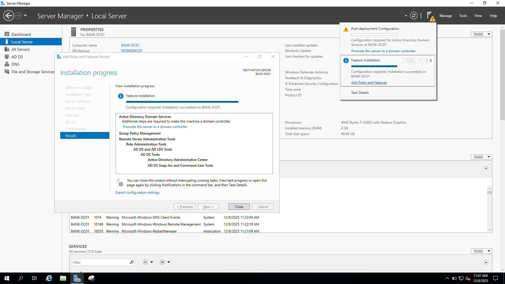
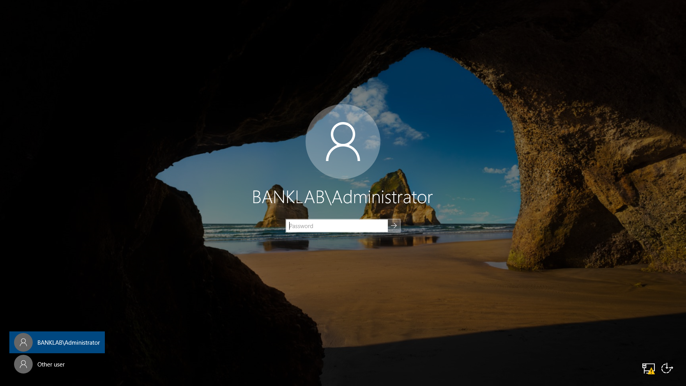
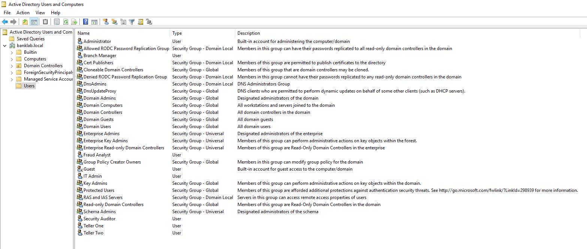
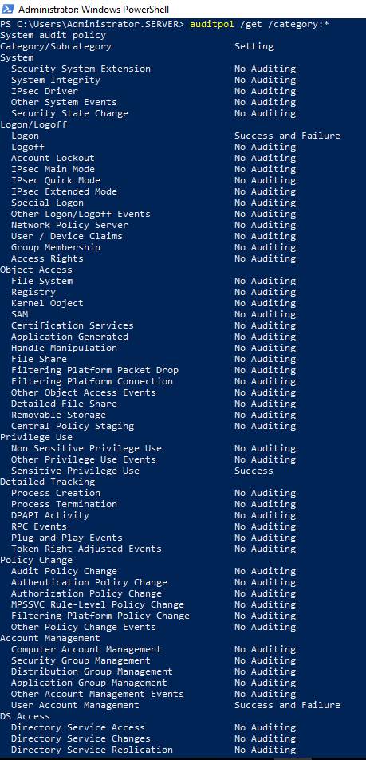
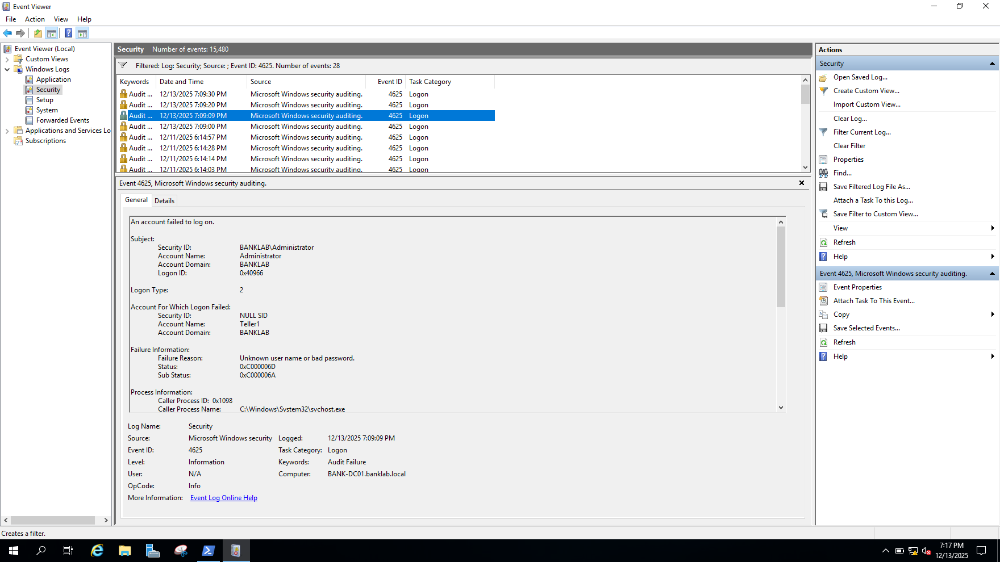
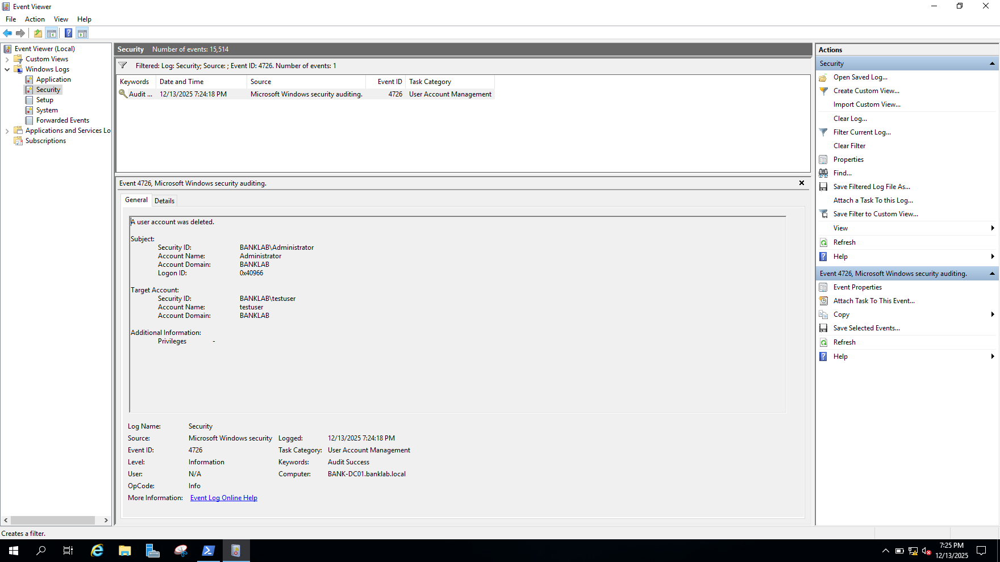

# Day 03 - Domain Controller Setup & Active Directory

## 🎯 Objective
Promoted BANK-DC01 to Domain Controller with new domain "banklab.local", created 6 bank user accounts representing different roles, and enabled audit policies to capture security events for SOC monitoring.

## 🏦 Banking SOC Context
Banks use Active Directory to centrally manage thousands of employee accounts, enforce security policies, and log authentication events - 70% of enterprise breaches involve compromised AD credentials, making DC monitoring critical for SOC operations.

---

## 📋 Tasks Completed

### Task 1: Verify Domain Controller Prerequisites

**What We Did:**
- Verified BANK-DC01 was demoted from old domain (server123.com)
- Confirmed computer renamed to BANK-DC01
- Checked workgroup membership and network connectivity

**Commands/Configuration:**
```powershell
# On BANK-DC01 - PowerShell as Administrator

# Check computer name
$env:COMPUTERNAME
# Output: BANK-DC01 ✓

# Check domain/workgroup status
(Get-WmiObject Win32_ComputerSystem).Domain
# Output: WORKGROUP ✓ (not in domain yet)

# Verify network connectivity
ping 192.168.56.1
# Output: 4 replies ✓

ping 8.8.8.8
# Output: 4 replies ✓
```

**Result:**
- BANK-DC01 ready for DC promotion
- Clean state (no old domain controllers)
- Network connectivity confirmed

✅ **Task 1 Complete**

---

### Task 2: Install Active Directory Domain Services Role

**What We Did:**
- Installed AD DS role using Server Manager
- Did NOT promote yet (promotion is separate step)
- Verified role installation successful

**Configuration Steps:**

1. Server Manager → Manage → Add Roles and Features
2. Before You Begin: Click Next
3. Installation Type: Role-based or feature-based installation → Click Next
4. Server Selection: Select BANK-DC01 → Click Next
5. Server Roles: Check **Active Directory Domain Services**
   - Popup: "Add features required for AD DS?" → Click "Add Features"
   - Click Next
6. Features: (No additional features) → Click Next
7. AD DS Information: Read page → Click Next
8. Confirmation: Check **Restart automatically if required** → Click Install
9. Installation Progress: Wait 3-5 minutes
10. Status: "Installation succeeded on BANK-DC01" ✓
11. Click Close

**Result:**
- AD DS role files installed successfully
- Yellow flag notification appeared: "Post-deployment Configuration"
- Server NOT yet a Domain Controller (just has the software ready)



✅ **Task 2 Complete**

---

### Task 3: Promote BANK-DC01 to Domain Controller

**What We Did:**
- Clicked promotion notification to start DC configuration wizard
- Created new forest "banklab.local"
- Configured DNS and Global Catalog services
- Set Directory Services Restore Mode (DSRM) password
- Completed promotion with automatic restart

**Configuration Steps:**

**Step 1 - Launch Promotion Wizard:**
- Server Manager → Click yellow flag → "Promote this server to a domain controller"

**Step 2 - Deployment Configuration:**
- Select: **Add a new forest**
- Root domain name: **banklab.local**
- Click Next

**Step 3 - Domain Controller Options:**
- Forest functional level: **Windows Server 2016**
- Domain functional level: **Windows Server 2016**
- Capabilities:
  - ☑ Domain Name System (DNS) server
  - ☑ Global Catalog (GC)
  - ☐ Read-only domain controller (RODC)
- DSRM Password: [Set password - same as Administrator for consistency]
- Click Next

**Step 4 - DNS Options:**
- Warning: "A delegation for this DNS server cannot be created..." (NORMAL - ignore)
- Click Next

**Step 5 - Additional Options:**
- NetBIOS domain name: **BANKLAB** (auto-filled)
- Click Next

**Step 6 - Paths:**
- Database folder: C:\Windows\NTDS
- Log files folder: C:\Windows\NTDS
- SYSVOL folder: C:\Windows\SYSVOL
- (All defaults - leave as is)
- Click Next

**Step 7 - Review Options:**
- Verify: Domain: banklab.local ✓, NetBIOS: BANKLAB ✓, DNS: Installed ✓
- Click Next

**Step 8 - Prerequisites Check:**
- Wizard runs validation (30-60 seconds)
- Yellow warnings (NORMAL): Windows Server defaults, DNS delegation
- Green checkmark: "All prerequisite checks passed successfully" ✓
- Click Install

**Step 9 - Installation:**
- Stages: Configuring AD DS, Configuring DNS, Creating domain partition
- Time: 5-10 minutes
- Server reboots automatically

**Step 10 - Verify After Restart:**
```powershell
# After reboot, log in as BANKLAB\Administrator
# Login screen NOW shows: BANKLAB\Administrator ✓

# Open PowerShell as Administrator
Get-ADDomain | Select-Object Name, Forest, DomainMode

# Expected output:
# Name      Forest         DomainMode
# ----      ------         ----------
# banklab   banklab.local  Windows2016Domain

# Verify DNS domain:
$env:USERDNSDOMAIN
# Output: BANKLAB.LOCAL ✓

# Verify computer object in AD:
Get-ADComputer -Identity BANK-DC01
# Output shows:
# DistinguishedName : CN=BANK-DC01,OU=Domain Controllers,DC=banklab,DC=local
# DNSHostName       : BANK-DC01.banklab.local
# Enabled           : True
```

**Result:**
- BANK-DC01 successfully promoted to Domain Controller
- New forest created: banklab.local
- NetBIOS name: BANKLAB
- DNS server running on DC
- Login format changed to "BANKLAB\Administrator"



✅ **Task 3 Complete**

---

### Task 4: Configure DNS Forwarders

**What We Did:**
- Configured DNS forwarders so DC can resolve external domain names
- Added Google DNS (8.8.8.8, 8.8.4.4) as forwarders
- Fixed yellow network icon (cosmetic issue)

**Configuration Steps:**

1. Server Manager → Tools → DNS
2. DNS Manager opens:
   - Expand BANK-DC01 in left panel
   - Right-click BANK-DC01 → Properties
   - Click "Forwarders" tab
   - Click "Edit" button
3. Add forwarders:
   - Type: **8.8.8.8** → Press Enter
   - Type: **8.8.4.4** → Press Enter
   - Click OK → Apply → OK
4. Close DNS Manager

**Verification:**
```cmd
nslookup google.com

# Expected output:
# Server:  BANK-DC01.banklab.local
# Address:  192.168.56.10
# Non-authoritative answer:
# Name:    google.com
# Address:  142.250.x.x  ✓ (DNS forwarding works!)
```

**Result:**
- DNS forwarders configured successfully
- DC can resolve internal names (banklab.local) AND external names (google.com)
- Network icon returned to normal

**Why This Matters:**
- Internal queries: "Where is BANK-EMP01?" → DC answers directly
- External queries: "Where is google.com?" → DC forwards to 8.8.8.8 → Gets answer

✅ **Task 4 Complete**

---

### Task 5: Create 6 Bank User Accounts

**What We Did:**
- Opened Active Directory Users and Computers (ADUC)
- Created 6 user accounts representing different bank employee roles
- Configured passwords and account settings

**Configuration Steps:**

**Step 1 - Open ADUC:**
- Server Manager → Tools → Active Directory Users and Computers

**Step 2 - Create Users (in Users container):**
- ADUC → Expand banklab.local → Click "Users" container
- Right-click in right panel → New → User

**User Accounts Created:**

| # | First Name | Last Name | Username     | Password | Role               |
|---|------------|-----------|--------------|----------|--------------------|
| 1 | Teller     | One       | teller1      | Bank@123 | Bank Teller        |
| 2 | Teller     | Two       | teller2      | Bank@123 | Bank Teller        |
| 3 | Branch     | Manager   | manager1     | Bank@123 | Branch Manager     |
| 4 | IT         | Admin     | itadmin      | Bank@123 | IT Administrator   |
| 5 | Security   | Auditor   | auditor      | Bank@123 | Compliance Auditor |
| 6 | Fraud      | Analyst   | fraudanalyst | Bank@123 | Fraud Analyst      |

**Settings for Each User:**
- User logon name: [username]@banklab.local
- Password: Bank@123
- ☐ User must change password at next logon (unchecked)
- ☑ Password never expires (checked - for lab convenience)

**Verification:**
```powershell
# List all users created
Get-ADUser -Filter * | Select-Object Name, SamAccountName

# Expected output:
# Name             SamAccountName
# ----             --------------
# Administrator    Administrator
# Guest            Guest
# Teller One       teller1
# Teller Two       teller2
# Branch Manager   manager1
# IT Admin         itadmin
# Security Auditor auditor
# Fraud Analyst    fraudanalyst
```

**Result:**
- 6 bank user accounts created successfully
- All usernames: teller1, teller2, manager1, itadmin, auditor, fraudanalyst
- All passwords: Bank@123 (for lab consistency)
- All accounts enabled and ready for domain login



✅ **Task 5 Complete**

---

### Task 6: Enable Audit Policies

**What We Did:**
- Configured Group Policy to log security events
- Enabled 3 critical audit policies for SOC monitoring
- Forced policy update to apply immediately

**Configuration Steps:**

**Step 1 - Open Group Policy Management:**
- Server Manager → Tools → Group Policy Management
- Expand: Forest: banklab.local → Domains → banklab.local

**Step 2 - Edit Default Domain Policy:**
- Right-click "Default Domain Policy" → Edit

**Step 3 - Navigate to Audit Policies:**
```
Computer Configuration
└── Policies
    └── Windows Settings
        └── Security Settings
            └── Advanced Audit Policy Configuration
                └── Audit Policies
```

**Step 4 - Enable Audit Logon Events:**
- Click "Logon/Logoff" folder
- Double-click "Audit Logon"
- Configure:
  - ☑ Configure the following audit events
  - ☑ Success
  - ☑ Failure
- Click OK

**Why:** Logs Event 4624 (successful login) and Event 4625 (failed login) - critical for detecting brute force attacks

**Step 5 - Enable Audit Account Management:**
- Click "Account Management" folder
- Double-click "Audit User Account Management"
- Configure:
  - ☑ Configure the following audit events
  - ☑ Success
  - ☑ Failure
- Click OK

**Why:** Logs Event 4720 (user created), Event 4726 (user deleted), Event 4732 (added to group) - detects rogue accounts and privilege escalation

**Step 6 - Enable Audit Privilege Use:**
- Click "Privilege Use" folder
- Double-click "Audit Sensitive Privilege Use"
- Configure:
  - ☑ Configure the following audit events
  - ☑ Success
  - ☐ Failure (leave unchecked)
- Click OK

**Why:** Logs Event 4672 (special privileges assigned) - detects when users exercise admin privileges

**Step 7 - Force Policy Update:**
```cmd
gpupdate /force

# Output:
# Updating policy...
# Computer Policy update has completed successfully.
# User Policy update has completed successfully.
```

**Verification:**
```cmd
auditpol /get /category:*

# Expected output (relevant sections):
# Logon/Logoff
#   Logon                                     Success and Failure ✓
# Account Management
#   User Account Management                   Success and Failure ✓
# Privilege Use
#   Sensitive Privilege Use                   Success ✓
```

**Result:**
- Audit policies enabled and active
- Windows will now log critical security events
- Events will be visible in Event Viewer (Security log)
- These events will flow to Splunk for SOC monitoring



✅ **Task 6 Complete**

---

### Task 7: Generate and Verify Test Events

**What We Did:**
- Generated test security events (failed login, successful login, user creation, privilege escalation)
- Verified events appeared in Event Viewer
- Captured screenshots of critical event types

**Test Events Generated:**

**Step 1 - Failed Login (Event 4625):**
```powershell
runas /user:BANKLAB\teller1 cmd
# Entered wrong password: WrongPassword123
# Result: "The user name or password is incorrect" ✓

# Repeated 2 more times with different wrong passwords
```

**Step 2 - Successful Login (Event 4624):**
```powershell
runas /user:BANKLAB\teller1 cmd
# Entered correct password: Bank@123
# Result: New CMD window opened ✓
```

**Step 3 - User Created (Event 4720):**
```powershell
New-ADUser -Name "Test User" -SamAccountName "testuser" -AccountPassword (ConvertTo-SecureString "Test@123" -AsPlainText -Force) -Enabled $true
# Result: User created ✓
```

**Step 4 - Privilege Escalation (Event 4732):**
```powershell
Add-ADGroupMember -Identity "Domain Admins" -Members testuser
# Result: testuser added to Domain Admins group ✓
```

**Step 5 - Verify Events in Event Viewer:**

1. Press Windows key → Type "Event Viewer" → Open
2. Expand Windows Logs → Click "Security"

**Filter by Event ID 4625 (Failed Login):**
- Right-click Security → Filter Current Log
- Event ID: **4625**
- Result: 3 events visible (the 3 wrong password attempts)
- Details show: Account Name: teller1, Failure Reason: Unknown user name or bad password ✓

**Filter by Event ID 4720 (User Created):**
- Result: 1 event
- Details: New Account Name: testuser, Created by: Administrator ✓

**Filter by Event ID 4732 (Added to Group):**
- Result: 1 event
- Details: Member: testuser, Group: Domain Admins ✓

**Step 6 - Cleanup:**
```powershell
Remove-ADUser -Identity testuser -Confirm:$false
# Result: Generates Event 4726 (User Deleted) - another event SOC monitors!
```

**Result:**
- All audit policies working correctly
- Events successfully captured in Security log
- Ready for Splunk integration (events will flow automatically once forwarder configured)





✅ **Task 7 Complete**

---

## 🔧 Technical Details

**VMs Used:**
- **BANK-DC01** (Windows Server 2019): Promoted to Domain Controller, configured DNS, created users, enabled audit policies

**Tools/Technologies:**
- **Active Directory Domain Services (AD DS)** v2019: Centralized user authentication and authorization
- **DNS Server** v2019: Domain Name System integrated with Active Directory
- **Group Policy Management**: Domain-wide security audit settings
- **Active Directory Users and Computers (ADUC)**: User/computer management GUI
- **Event Viewer**: Windows log viewing tool
- **PowerShell**: Automated user creation, verification, policy updates

**Network Configuration:**
- BANK-DC01 IP: 192.168.56.10
- DNS Server: 192.168.56.10 (self - DC is now DNS server)
- DNS Forwarders: 8.8.8.8, 8.8.4.4 (Google DNS)

**Active Directory Configuration:**

| Setting          | Value               |
|------------------|---------------------|
| Forest           | banklab.local       |
| Domain           | banklab.local       |
| NetBIOS Name     | BANKLAB             |
| Functional Level | Windows Server 2016 |
| DNS Integrated   | Yes                 |
| Global Catalog   | Yes (on BANK-DC01)  |

**Files Created/Modified:**
- AD Database: C:\Windows\NTDS\ntds.dit
- AD Logs: C:\Windows\NTDS\*.log
- SYSVOL: C:\Windows\SYSVOL\ (domain policies and scripts)
- DNS Zones: Integrated in AD (banklab.local zone)

---

## 🔑 Key Data Created

**CRITICAL - Future threads will need these exact values:**

### Active Directory Domain
- **Domain Name (FQDN)**: banklab.local
- **NetBIOS Domain Name**: BANKLAB
- **Domain Controller**: BANK-DC01.banklab.local
- **Domain Controller IP**: 192.168.56.10
- **Forest Functional Level**: Windows2016Domain
- **Domain Functional Level**: Windows2016Domain

### DNS Configuration
- **Primary DNS Server**: 192.168.56.10 (BANK-DC01)
- **DNS Forwarders**: 8.8.8.8, 8.8.4.4
- **DNS Zone**: banklab.local (AD-integrated)

### User Accounts Created

| Username     | Full Name        | Role                 | Password | Status  |
|--------------|------------------|----------------------|----------|---------|
| teller1      | Teller One       | Bank Teller          | Bank@123 | Enabled |
| teller2      | Teller Two       | Bank Teller          | Bank@123 | Enabled |
| manager1     | Branch Manager   | Branch Manager       | Bank@123 | Enabled |
| itadmin      | IT Admin         | IT Administrator     | Bank@123 | Enabled |
| auditor      | Security Auditor | Compliance Auditor   | Bank@123 | Enabled |
| fraudanalyst | Fraud Analyst    | Fraud Detection Team | Bank@123 | Enabled |

**Login Format**: BANKLAB\username or just username (domain assumed)

### Audit Policies Enabled

| Policy Name                   | Success | Failure | Event IDs Generated                                   |
|-------------------------------|---------|---------|-------------------------------------------------------|
| Audit Logon                   | ✓       | ✓       | 4624 (success), 4625 (failure)                        |
| Audit User Account Management | ✓       | ✓       | 4720 (created), 4726 (deleted), 4732 (added to group) |
| Audit Sensitive Privilege Use | ✓       | ✗       | 4672 (special privileges)                             |

### Security Events for SOC Monitoring

| Event ID | Description                  | SOC Use Case                                                      |
|----------|------------------------------|-------------------------------------------------------------------|
| 4624     | Successful logon             | Track user activity, baseline normal logins                       |
| 4625     | Failed logon                 | Brute force detection - alert on 10+ failures                     |
| 4720     | User account created         | Detect rogue accounts created by attackers                        |
| 4726     | User account deleted         | Detect account cleanup after compromise                           |
| 4732     | User added to security group | Privilege escalation detection - alert on Domain Admins additions |
| 4672     | Special privileges assigned  | Track admin-level access                                          |
