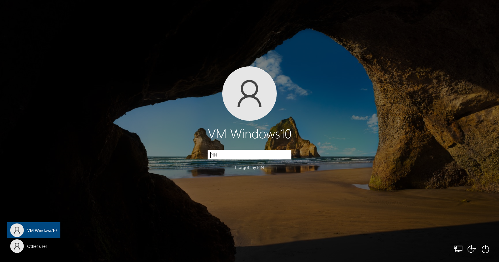
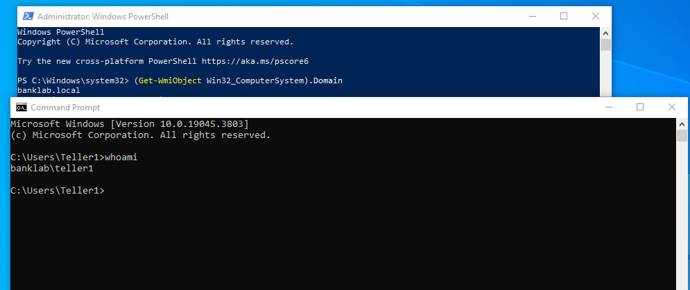
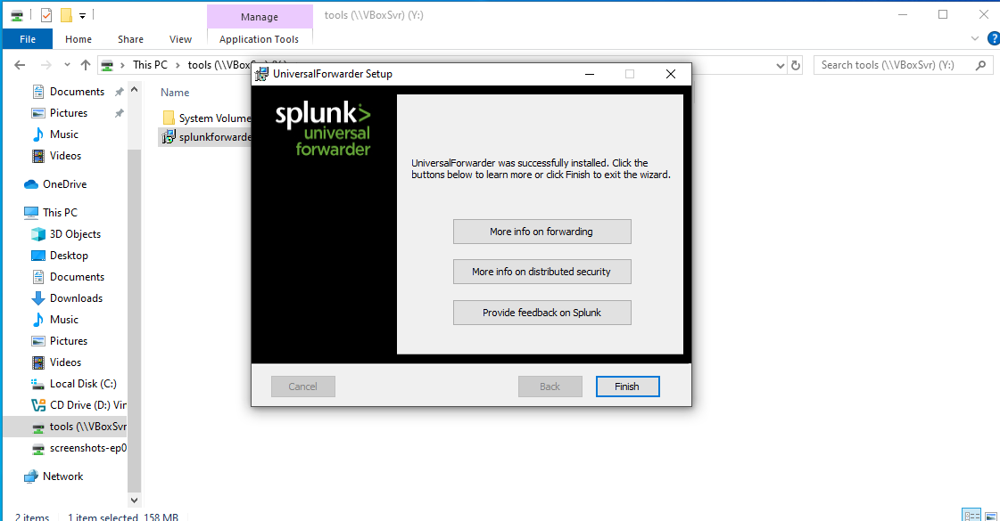
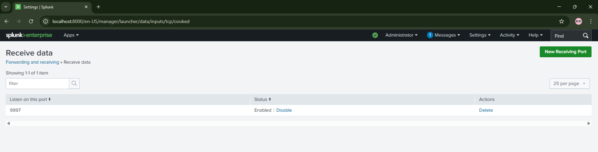
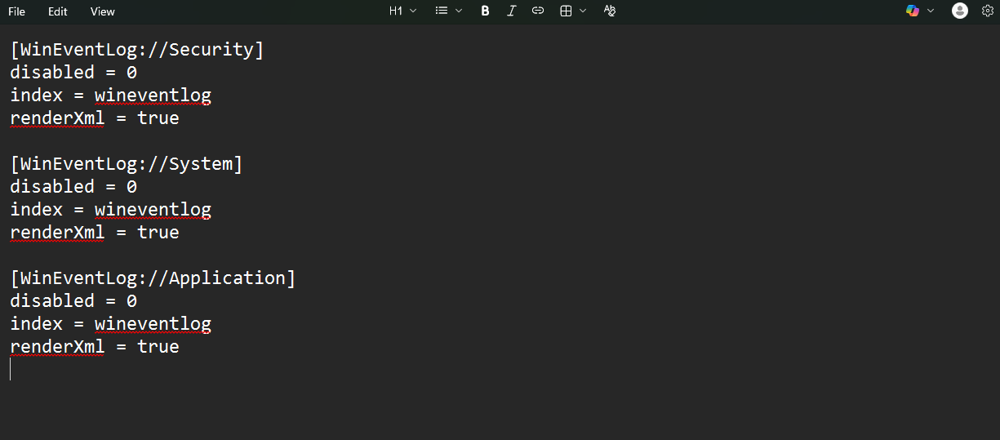
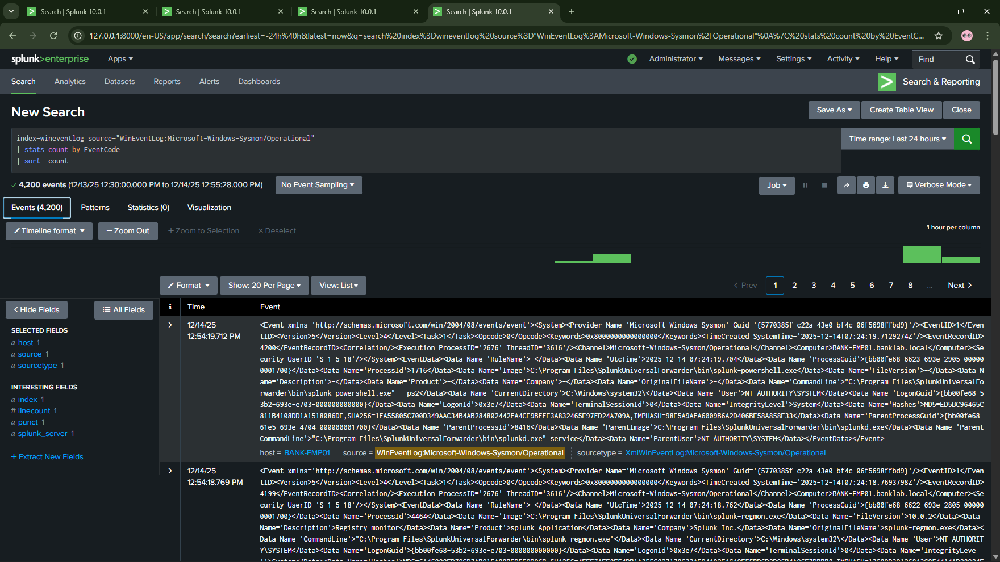
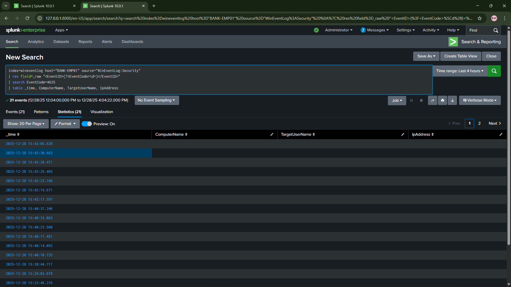
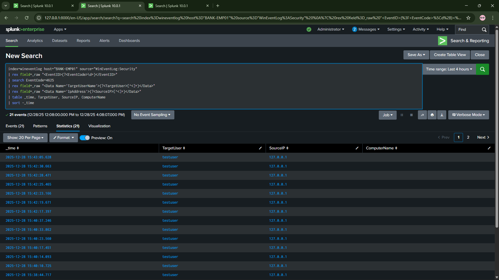
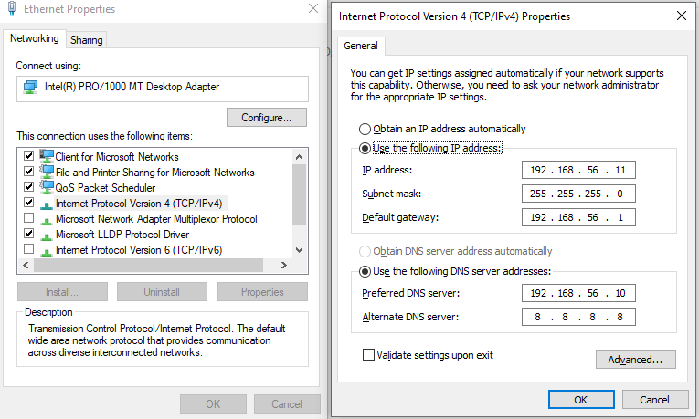

# Day 04 - Employee Workstation Domain Join & Splunk Forwarder

## 🎯 Objective
Joined BANK-EMP01 workstation to banklab.local domain, installed Splunk Universal Forwarder, configured Windows Event Log forwarding to Splunk, and verified authentication events flowing to SIEM for SOC monitoring.

## 🏦 Banking SOC Context
Bank workstations generate 80% of security incidents (phishing, malware, insider threats) - SOC analysts need real-time visibility into employee machine activity through centralized log collection and alerting.

---

## 📋 Tasks Completed

### Task 1: Configure DNS on BANK-EMP01

**What We Did:**
- Started BANK-DC01 first (required for domain join)
- Changed DNS on BANK-EMP01 from Google DNS (8.8.8.8) to Domain Controller (192.168.56.10)
- Verified DNS resolution for domain resources

**Commands/Configuration:**

**Step 1 - Start Domain Controller:**
- VirtualBox → Start BANK-DC01 VM
- Wait for login screen
- Log in as BANKLAB\Administrator

**Step 2 - Start BANK-EMP01 and Modify DNS:**
- VirtualBox → Start BANK-EMP01 VM
- Log in as VM WINDOWS10 (local account)
- Settings → Network & Internet → Change adapter options
- Right-click Ethernet adapter (Host-Only - 192.168.56.11) → Properties
- Select "Internet Protocol Version 4 (TCP/IPv4)" → Properties

**Current configuration:**
- IP address: 192.168.56.11
- Subnet mask: 255.255.255.0
- Default gateway: 192.168.56.1
- Preferred DNS: 8.8.8.8 ← CHANGE THIS
- Alternate DNS: 8.8.4.4 ← CHANGE THIS

**New configuration:**
- IP address: 192.168.56.11
- Subnet mask: 255.255.255.0
- Default gateway: 192.168.56.1
- Preferred DNS: 192.168.56.10 ← Domain Controller
- Alternate DNS: (leave blank)
- Click OK → OK

**Step 3 - Verify DNS Resolution:**
```cmd
# Command Prompt on BANK-EMP01

# Test DC resolution by hostname
nslookup BANK-DC01

# Expected output:
# Server:  BANK-DC01.banklab.local
# Address:  192.168.56.10
# 
# Name:    BANK-DC01.banklab.local
# Address:  192.168.56.10
# ✓ (Resolved correctly!)

# Test domain name resolution
nslookup banklab.local

# Expected output:
# Server:  BANK-DC01.banklab.local
# Address:  192.168.56.10
# 
# Name:    banklab.local
# Address:  192.168.56.10
# ✓ (Domain found!)

# Verify internet still works (DNS forwarder on DC)
nslookup google.com

# Expected output:
# Server:  BANK-DC01.banklab.local
# Address:  192.168.56.10
# 
# Non-authoritative answer:
# Name:    google.com
# Address:  142.250.x.x
# ✓ (Internet resolution working through DC!)

# Test ping to DC
ping BANK-DC01.banklab.local

# Result: 4 replies from 192.168.56.10 ✓
```

**Result:**
- DNS pointing to Domain Controller (192.168.56.10)
- Can resolve domain names (banklab.local, BANK-DC01)
- Internet DNS still works (via forwarders on DC)
- Ready for domain join

✅ **Task 1 Complete**

---

### Task 2: Join BANK-EMP01 to banklab.local Domain

**What We Did:**
- Joined BANK-EMP01 to banklab.local domain using Domain Administrator credentials
- Restarted computer to apply domain membership
- Verified domain join and logged in with domain account

**Commands/Configuration:**

**Step 1 - Initiate Domain Join:**

On BANK-EMP01:
- Right-click Start → System
- Click "Rename this PC (advanced)"
- System Properties window opens:
  - Computer Name tab
  - Click "Change..." button

**Step 2 - Configure Domain Membership:**

Computer Name/Domain Changes window:
- Computer name: BANK-EMP01 (already set from Day 2)
- Member of:
  - ⦿ Domain: **banklab.local** (selected domain radio button, typed domain name)
- Click OK

**Step 3 - Enter Domain Credentials:**

Windows Security popup appears:
- Prompt: "Enter the name and password of an account with permission to join the domain"
- User name: **Administrator**
- Password: [Domain admin password]
- Click OK
- Wait 10-15 seconds...

**Step 4 - Domain Join Success:**

Success message appears:
- "Welcome to the banklab.local domain"
- Click OK

Restart prompt:
- "You must restart your computer to apply these changes"
- Click OK

System Properties window:
- Click "Close"

Restart prompt appears again:
- Click "Restart Now"

**Step 5 - Verify Domain Join After Restart:**

After restart, login screen shows:
- "Other user"
- Domain: BANKLAB ← (This confirms domain join!)

Log in:
- User name: **teller1**
- Password: **Bank@123**
- Login successful ✓
- Desktop loads with domain profile

**Step 6 - Verify from Command Prompt:**
```cmd
# Command Prompt on BANK-EMP01 (logged in as BANKLAB\teller1)

# Check computer domain membership
systeminfo | findstr /B /C:"Domain"

# Output:
# Domain:                    banklab.local ✓

# Check logged-in user
whoami

# Output:
# banklab\teller1 ✓

# Verify domain controller connectivity
nltest /dsgetdc:banklab.local

# Output:
# DC: \\BANK-DC01
# Address: \\192.168.56.10
# Dom Guid: [GUID]
# Dom Name: banklab.local
# The command completed successfully ✓
```

**Result:**
- BANK-EMP01 successfully joined to banklab.local domain
- Login format changed from "VM WINDOWS10" to "BANKLAB\username"
- Domain users (teller1, teller2, manager1, etc.) can now log in to this workstation
- Computer object created in Active Directory on BANK-DC01





✅ **Task 2 Complete**

---

### Task 3: Install Splunk Universal Forwarder on BANK-EMP01

**What We Did:**
- Downloaded Splunk Universal Forwarder installer from Splunk website
- Installed on BANK-EMP01 with deployment server pointing to Splunk host
- Configured receiving port on Splunk Enterprise (host machine)
- Verified forwarder connection

**Commands/Configuration:**

**Step 1 - Download Splunk Universal Forwarder:**

On BANK-EMP01 (logged in as BANKLAB\teller1):
- Open Microsoft Edge
- Navigate to: https://www.splunk.com/en_us/download/universal-forwarder.html
- Select: Windows (64-bit)
- Version: 9.1.2 (or latest stable)
- Click "Download Now"
- Create free Splunk account or log in
- Accept license agreement
- Download: splunkforwarder-9.1.2-...-x64-release.msi
- Save to: C:\Users\teller1\Downloads\

**Step 2 - Install Splunk Universal Forwarder:**

- Navigate to Downloads folder
- Right-click splunkforwarder-9.1.2-...-x64-release.msi → Run as administrator
- Enter local admin password if prompted

Splunk Universal Forwarder Setup Wizard:

1. **Welcome page:**
   - Click Next

2. **License Agreement:**
   - ⦿ I accept the terms in the License Agreement
   - Click Next

3. **Destination Folder:**
   - C:\Program Files\SplunkUniversalForwarder\
   - Click Next

4. **Deployment Server (IMPORTANT):**
   - Deployment Server: **192.168.56.1** ← Host machine (Splunk Enterprise)
   - Receiving Port: **8089** (default)
   - Click Next

5. **Receiving Indexer:**
   - Hostname or IP: **192.168.56.1** ← Host machine
   - Port: **9997** ← Splunk receiving port
   - Click Next

6. **Local System User:**
   - ⦿ Local System (default)
   - Click Next

7. **Administrator Credentials:**
   - Username: **admin**
   - Password: [Set strong password - e.g., Admin@123]
   - Confirm password: [Re-enter]
   - Click Next

8. **Ready to Install:**
   - Click Install

9. **Installation Progress:**
   - Wait 2-3 minutes

10. **Completed:**
    - ☐ Launch Splunk Universal Forwarder (leave unchecked - runs as service)
    - Click Finish

**Step 3 - Verify Installation:**
```cmd
# Command Prompt as Administrator on BANK-EMP01

# Check if service is running
sc query SplunkForwarder

# Expected output:
# SERVICE_NAME: SplunkForwarder
# STATE              : 4  RUNNING
#         (STOPPABLE, NOT_PAUSABLE, ACCEPTS_SHUTDOWN)
# ✓

# Check installation directory
dir "C:\Program Files\SplunkUniversalForwarder"

# Expected output:
# bin\
# etc\
# lib\
# [other folders...]
# ✓
```

**Step 4 - Configure Splunk Enterprise to Receive Data (on HOST machine):**

On Windows 11 Host:
- Open Splunk Web: http://localhost:8000
- Log in as admin
- Settings → Forwarding and receiving
- Click "Configure receiving"
- Click "New Receiving Port"
- Listen on this port: **9997**
- Click Save
- Confirmation: "New receiving port has been created: 9997" ✓
- Go to Settings → Forwarding and receiving → Receive data
- Verify: Port 9997 is listed and enabled

**Step 5 - Verify Connection from Forwarder to Indexer:**

On Splunk Web (host):
- Settings → Forwarders

Expected to see:
- Forwarder: BANK-EMP01 (or BANK-EMP01.banklab.local)
- Host: 192.168.56.11
- Status: Active (green checkmark) ✓

(Note: May take 1-2 minutes for forwarder to appear after installation)

**Result:**
- Splunk Universal Forwarder installed on BANK-EMP01
- Configured to send logs to Splunk Enterprise (192.168.56.1:9997)
- Connection verified (forwarder showing as active)
- Service running automatically on startup





✅ **Task 3 Complete**

---

### Task 4: Configure Windows Event Log Forwarding

**What We Did:**
- Created inputs.conf file to specify which Windows Event Logs to forward
- Configured Security, System, and Application logs
- Specified wineventlog index for received data
- Restarted Splunk forwarder to apply configuration

**Commands/Configuration:**

**Step 1 - Navigate to Splunk Forwarder Configuration Directory:**
```cmd
# Command Prompt as Administrator on BANK-EMP01

cd "C:\Program Files\SplunkUniversalForwarder\etc\system\local"

# Check existing files
dir

# If inputs.conf doesn't exist, we'll create it
```

**Step 2 - Create inputs.conf Configuration File:**
```cmd
# Create inputs.conf using Notepad
notepad inputs.conf

# If file doesn't exist, click "Yes" to create new file
```

**Step 3 - Add Windows Event Log Configuration:**

Copy-paste this into inputs.conf:
```ini
[WinEventLog://Security]
disabled = 0
index = wineventlog
renderXml = true

[WinEventLog://System]
disabled = 0
index = wineventlog
renderXml = true

[WinEventLog://Application]
disabled = 0
index = wineventlog
renderXml = true
```

Save file: Ctrl+S → Close Notepad

**Configuration Explained:**
- `[WinEventLog://Security]` - Monitor Windows Security log (Event IDs 4624, 4625, 4720, etc.)
- `disabled = 0` - Enable this input
- `index = wineventlog` - Send logs to wineventlog index in Splunk
- `renderXml = true` - Include XML event details for better parsing

**Step 4 - Create wineventlog Index on Splunk (Host Machine):**

On Host (Windows 11):
- Open Splunk Web: http://localhost:8000
- Log in as admin
- Settings → Indexes → New Index
- Index Name: **wineventlog**
- Index Data Type: Events (default)
- Home Path: $SPLUNK_DB\wineventlog\db (auto-filled)
- Max Size of Entire Index: **500 MB** (for lab)
- Click Save

**Step 5 - Restart Splunk Universal Forwarder:**
```cmd
# Command Prompt as Administrator on BANK-EMP01

cd "C:\Program Files\SplunkUniversalForwarder\bin"

# Stop forwarder
splunk.exe stop

# Output:
# Stopping splunkd...
# Shutting down. Please wait...
# Done.

# Start forwarder
splunk.exe start

# Output:
# Splunk> Take the sh out of IT.
# 
# Checking prerequisites...
# ...
# All preliminary checks passed.
# Starting splunk server daemon (splunkd)...
# Done.
```

**Step 6 - Verify Logs Flowing to Splunk:**

On Splunk Web (host):
- Search & Reporting app
- Search query:
```spl
index=wineventlog
```
- Time range: Last 15 minutes
- Click Search

Expected results:
- Events from BANK-EMP01 appearing
- Event details show:
  - host: BANK-EMP01 (or BANK-EMP01.banklab.local)
  - source: WinEventLog:Security (or System, Application)
  - index: wineventlog
  - EventCode: [various - 4624, 4625, etc.]
  - ComputerName: BANK-EMP01
  - ✓ (Logs flowing!)

Refine search to see authentication events:
```spl
index=wineventlog EventCode=4624
```
Results show successful logins (including teller1 login)

**Result:**
- Windows Event Logs (Security, System, Application) forwarding to Splunk
- Logs visible in wineventlog index
- Real-time log collection working
- SOC has visibility into BANK-EMP01 activity





✅ **Task 4 Complete**

---

### Task 5: Test and Verify Authentication Event Logging

**What We Did:**
- Generated authentication events (failed login, successful login)
- Searched for events in Splunk by EventCode
- Verified event details contain critical forensic information
- Confirmed end-to-end log pipeline working

**Commands/Configuration:**

**Step 1 - Generate Failed Login Events:**

On BANK-EMP01:
- Lock screen (Windows+L)
- Login screen appears:
  - Click "Other user"
  - Username: **teller1**
  - Password: **WrongPassword123** ← Intentionally wrong
  - Press Enter
- Error: "The user name or password is incorrect"

Repeat 2 more times:
- Username: **teller1**
- Password: **HackerAttempt456**
- Username: **teller1**
- Password: **FailedLogin789**

After 3 failed attempts, log in successfully:
- Username: **teller1**
- Password: **Bank@123** ← Correct password
- Desktop loads ✓

**Step 2 - Wait for Events to Reach Splunk:**
- Wait 30-60 seconds (forwarder batches events every 30 seconds)

**Step 3 - Search for Failed Login Events in Splunk:**

Splunk Web (host) → Search & Reporting

Search query:
```spl
index=wineventlog host=BANK-EMP01 EventCode=4625
```

Time range: Last 15 minutes

Click Search

Expected results:
- 3 events (the 3 failed login attempts)

Click on one event to expand details:
- EventCode: 4625
- Message: "An account failed to log on"
- TargetUserName: teller1
- FailureReason: Unknown user name or bad password
- IpAddress: 192.168.56.11 (or ::1 if local)
- LogonType: 2 (Interactive - keyboard login)
- ComputerName: BANK-EMP01
- TimeCreated: [timestamp of failed attempt]
- ✓ All forensic details captured!

**Step 4 - Search for Successful Login Event:**

Search query:
```spl
index=wineventlog host=BANK-EMP01 EventCode=4624 TargetUserName=teller1
```

Results:
- 1 or more events (successful login)

Expand event details:
- EventCode: 4624
- Message: "An account was successfully logged on"
- TargetUserName: teller1
- TargetDomainName: BANKLAB
- LogonType: 2 (Interactive)
- IpAddress: 192.168.56.11
- ComputerName: BANK-EMP01
- TimeCreated: [timestamp after failed attempts]
- ✓ Successful login captured!

**Step 5 - Create Test Search for Brute Force Detection:**

Splunk Search query:
```spl
index=wineventlog EventCode=4625 
| stats count by TargetUserName, ComputerName
| where count > 2
```

Results:
- TargetUserName: teller1
- ComputerName: BANK-EMP01
- count: 3
- ✓ (This is the basis for brute force alert we'll create in Week 2!)

**Result:**
- End-to-end logging pipeline verified working
- Failed logins (Event 4625) captured with full forensic details
- Successful logins (Event 4624) captured
- Query capability proven for future alert creation
- SOC can now detect authentication attacks on employee workstations





✅ **Task 5 Complete**

---

## 🛠️ Troubleshooting

### Problem 1: Domain Join Failed - "The specified domain either does not exist or could not be contacted"

**Error Message/Symptom:**

When clicking OK after entering "banklab.local":

Error popup:
- "The following error occurred attempting to join the domain 'banklab.local':
- The specified domain either does not exist or could not be contacted."

**Root Cause:**

DNS on BANK-EMP01 was still pointing to 8.8.8.8 (Google DNS) instead of Domain Controller (192.168.56.10) - Google DNS doesn't know about banklab.local domain

**Solution Steps:**

1. Cancelled domain join wizard

2. Changed DNS configuration:
   - Network adapter properties
   - Preferred DNS: **192.168.56.10** ← Changed from 8.8.8.8
   - Alternate DNS: **(blank)** ← Removed 8.8.4.4
   - Click OK

3. Verified DNS resolution:
```cmd
nslookup banklab.local
# Server:  BANK-DC01.banklab.local
# Address:  192.168.56.10
# Name:    banklab.local  ✓
```

4. Retried domain join - Success!



---

### Problem 2: Splunk Forwarder Not Appearing in Splunk Web

**Error Message/Symptom:**

After installing Splunk Universal Forwarder on BANK-EMP01:
- Settings → Forwarders → (No forwarders listed)

**Root Cause:**

Receiving port 9997 was not enabled on Splunk Enterprise (host machine)

**Solution Steps:**

1. On Splunk Web (host):
   - Settings → Forwarding and receiving
   - Click "Configure receiving"
   - Click "New Receiving Port"
   - Port: **9997**
   - Click Save

2. Waited 1-2 minutes for forwarder to reconnect

3. Refreshed Settings → Forwarders page

4. Result: BANK-EMP01 now listed with green "Active" status ✓

**Verification:**
- Settings → Forwarders
- Forwarder: BANK-EMP01.banklab.local
- Host: 192.168.56.11
- Status: Active ✓

---

## 🔧 Technical Details

**VMs Used:**
- **BANK-DC01**: Windows Server 2019 - Running as Domain Controller (required for BANK-EMP01 to join domain and authenticate users)
- **BANK-EMP01**: Windows 10 - Joined to domain, Splunk UF installed, logs forwarding

**Tools/Technologies:**
- **Active Directory Client**: Windows 10 domain membership - Authenticates users against BANK-DC01
- **Splunk Universal Forwarder**: v9.1.2 - Lightweight log collector installed on endpoint
- **inputs.conf**: Splunk configuration file - Specifies which Windows Event Logs to forward
- **Splunk Forwarder Management**: Port 8089 - Management protocol between forwarder and deployment server
- **Splunk Receiving**: Port 9997 - Data forwarding protocol (uses Splunk-to-Splunk protocol, compressed)

**Network Configuration:**
- BANK-EMP01 IP: 192.168.56.11 (Host-Only adapter)
- DNS Server: 192.168.56.10 (BANK-DC01 - required for domain name resolution)
- Splunk Indexer: 192.168.56.1 (Host machine) - Port 9997
- Domain: banklab.local

**Splunk Configuration:**

| Component            | Value                         | Purpose                           |
|----------------------|-------------------------------|-----------------------------------|
| Receiving Port       | 9997                          | Listens for forwarder connections |
| Index Name           | wineventlog                   | Stores Windows Event Logs         |
| Forwarder Management | Port 8089                     | Deployment server communication   |
| Event Logs Forwarded | Security, System, Application | Core Windows logs                 |
| Rendering Format     | XML (renderXml=true)          | Preserves event structure         |

**Files Created/Modified:**

| File Path                                                                    | Purpose                          |
|------------------------------------------------------------------------------|----------------------------------|
| C:\Program Files\SplunkUniversalForwarder\etc\system\local\inputs.conf      | Defines Windows Event Log inputs |
| C:\Program Files\SplunkUniversalForwarder\var\log\splunk\splunkd.log        | Forwarder operation logs         |

---

## 🔑 Key Data Created

**CRITICAL - Future threads will need these exact values:**

### Domain-Joined Computer
- **Computer Name**: BANK-EMP01
- **FQDN**: BANK-EMP01.banklab.local
- **Domain**: banklab.local
- **IP Address**: 192.168.56.11
- **DNS Server**: 192.168.56.10 (BANK-DC01)

### Splunk Universal Forwarder Configuration
- **Installation Path**: C:\Program Files\SplunkUniversalForwarder\
- **Receiving Indexer**: 192.168.56.1:9997 (Host machine)
- **Deployment Server**: 192.168.56.1:8089
- **Admin Username**: admin
- **Admin Password**: Admin@123 (for local forwarder management)

### Event Log Forwarding
- **Source Logs**: WinEventLog:Security, WinEventLog:System, WinEventLog:Application
- **Destination Index**: wineventlog
- **Rendering**: XML format (renderXml=true)
- **Status**: Active and forwarding

### Splunk Index Configuration (Host)
- **Index Name**: wineventlog
- **Max Size**: 500 MB
- **Data Type**: Events
- **Home Path**: $SPLUNK_DB\wineventlog\db

### Authentication Events Captured

| Event ID | Event Description           | Fields Available in Splunk                                           |
|----------|-----------------------------|----------------------------------------------------------------------|
| 4624     | Successful logon            | TargetUserName, TargetDomainName, LogonType, IpAddress, ComputerName |
| 4625     | Failed logon                | TargetUserName, FailureReason, LogonType, IpAddress, ComputerName    |
| 4634     | Logoff                      | TargetUserName, LogonType, ComputerName                              |
| 4672     | Special privileges assigned | SubjectUserName, PrivilegeList, ComputerName                         |

### Test Data Generated
- **Failed Logins**: 3 events (Event 4625) for user teller1
- **Successful Login**: 1 event (Event 4624) for user teller1
- **Time Range**: [Date of testing]
- **Purpose**: Baseline data for Week 2 alert creation
