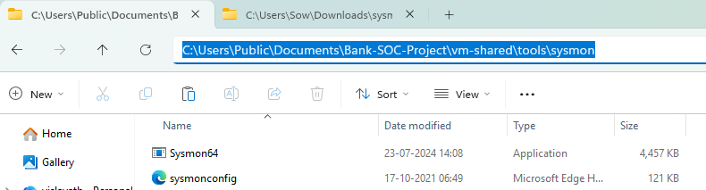
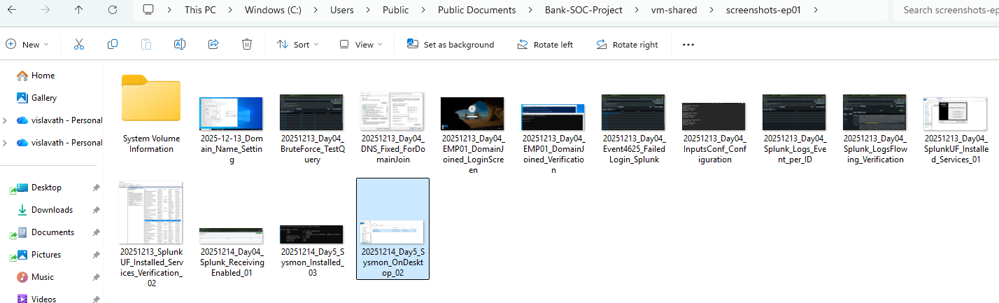
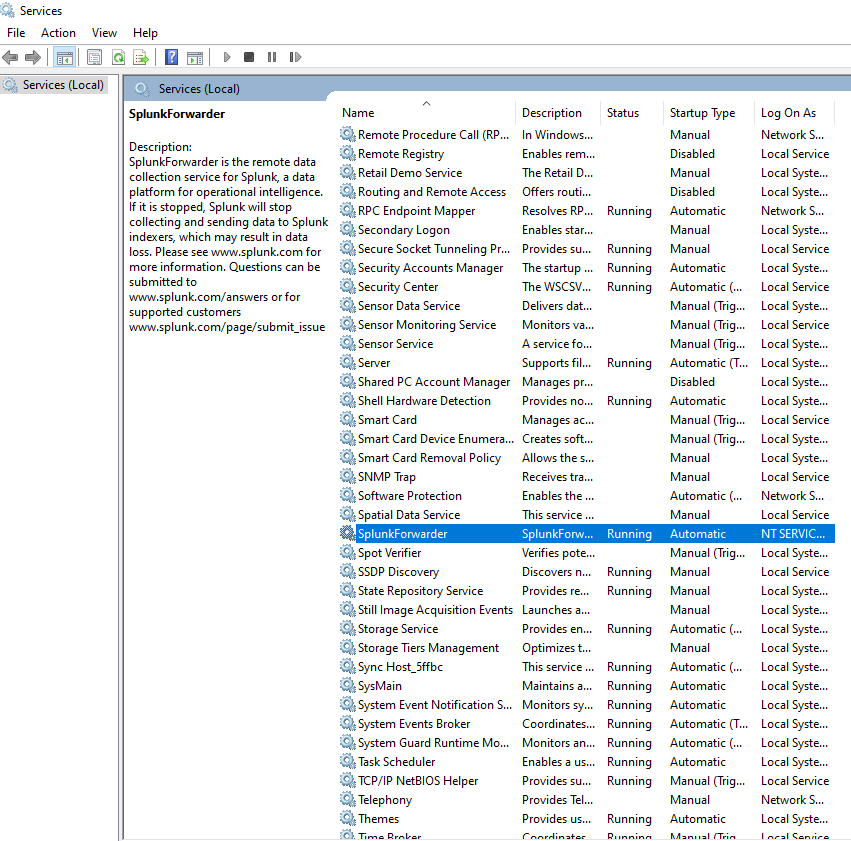
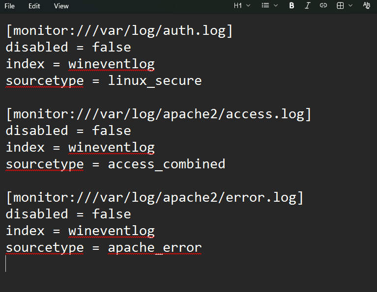
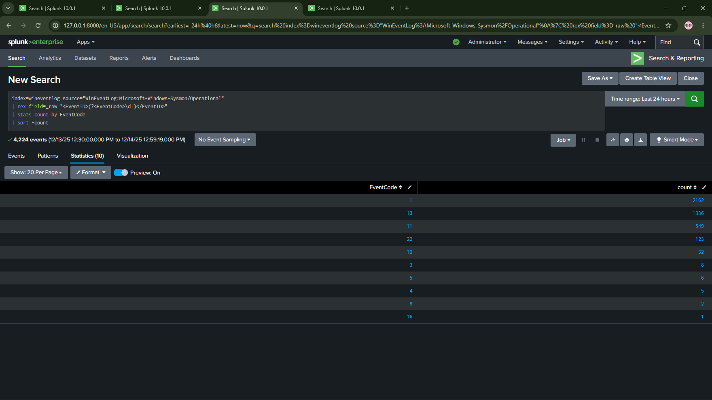

# Day 05 - Sysmon Installation on Employee Workstation

## 🎯 Objective
Install Microsoft Sysmon with SwiftOnSecurity configuration on BANK-EMP01 to capture detailed process execution, network connections, file creation, and registry modifications for advanced threat detection.

## 🏦 Banking SOC Context
Banks use Sysmon to detect fileless malware, PowerShell attacks, credential theft, and lateral movement—threats that standard Windows Event Logs miss completely, making it essential for modern SOC operations.

---

## 📋 Tasks Completed

### Task 1: Download Sysmon and Configuration File

**What We Did:**
- Downloaded Sysmon64.exe from Microsoft Sysinternals
- Downloaded SwiftOnSecurity's sysmon-config (battle-tested baseline used by SOC teams worldwide)
- Placed files in shared folder for VM access

**Commands/Configuration:**
```bash
# Files downloaded to host machine
# Location: C:\Bank-SOC-Project\vm-shared\tools\sysmon\
# Files:
#   - Sysmon64.exe
#   - sysmonconfig.xml (renamed from sysmonconfig-export.xml)
```

**Result:**
- Files successfully downloaded and placed in shared folder
- Accessible from BANK-EMP01 via Z:\tools\sysmon\



✅ **Task 1 Complete**

---

### Task 2: Access Shared Folder from BANK-EMP01

**What We Did:**
- Started BANK-EMP01 VM (shut down BANK-DC01 to save RAM)
- Accessed Z:\ drive (shared folder)
- Copied Sysmon files to desktop for easier installation

**Commands/Configuration:**
```cmd
# On BANK-EMP01
# Navigate to: Z:\tools\sysmon\
# Copy both files to: C:\Users\[Admin]\Desktop\sysmon\
```

**Result:**
- Successfully accessed shared folder
- Copied Sysmon installation files to BANK-EMP01 desktop



✅ **Task 2 Complete**

---

### Task 3: Install Sysmon with Configuration

**What We Did:**
- Opened Command Prompt as Administrator on BANK-EMP01
- Installed Sysmon with SwiftOnSecurity configuration
- Verified Sysmon service running

**Commands/Configuration:**
```cmd
# Navigate to desktop folder
cd C:\Users\[AdminUsername]\Desktop\sysmon

# Install Sysmon with config
Sysmon64.exe -i sysmonconfig.xml -accepteula

# Output:
# Sysmon64 started.

# Verify service running
sc query Sysmon64

# Expected output:
# SERVICE_NAME: Sysmon64
# STATE              : 4  RUNNING
#         (STOPPABLE, NOT_PAUSABLE, ACCEPTS_SHUTDOWN)
```

**Result:**
- Sysmon64 service started successfully
- Service shows STATE: 4 RUNNING
- Sysmon now monitoring system activity



✅ **Task 3 Complete**

---

### Task 4: Configure Splunk Universal Forwarder to Collect Sysmon Logs

**What We Did:**
- Modified inputs.conf to add Sysmon event log channel
- Added renderXml = 1 parameter for full XML event data
- Restarted SplunkForwarder service

**Commands/Configuration:**

**Step 1 - Edit inputs.conf:**
```cmd
# Edit inputs.conf (Notepad as Administrator)
# File: C:\Program Files\SplunkUniversalForwarder\etc\system\local\inputs.conf

notepad "C:\Program Files\SplunkUniversalForwarder\etc\system\local\inputs.conf"
```

**Step 2 - Add Sysmon Configuration:**

Add this section to inputs.conf:
```ini
[WinEventLog://Microsoft-Windows-Sysmon/Operational]
disabled = 0
index = wineventlog
renderXml = 1
```

Save file: Ctrl+S → Close Notepad

**Step 3 - Restart Splunk Forwarder:**
```cmd
# Restart Splunk Forwarder
net stop SplunkForwarder
net start SplunkForwarder

# Expected output:
# The SplunkForwarder service is stopping.
# The SplunkForwarder service was stopped successfully.
# The SplunkForwarder service is starting.
# The SplunkForwarder service was started successfully.
```

**Result:**
- Sysmon log collection configured
- Service restarted successfully
- Configuration applied



✅ **Task 4 Complete**

---

## 🛠️ Troubleshooting

### Problem 1: Service Not Responding (net stop SplunkForwarder)

**Error Message/Symptom:**
```cmd
C:\Users\Teller1\Desktop\sysmon>net stop SplunkForwarder
The service is not responding to the control function.
More help is available by typing NET HELPMSG 2186.
```

**Root Cause:**

SplunkForwarder service was busy processing or hung, unable to respond to standard stop command.

**Solution Steps:**

1. Checked service processes:
```cmd
tasklist | findstr splunk
# Found: splunkd.exe (11084), splunk-winevtlog.exe (7804)
```

2. Force-killed the processes:
```cmd
taskkill /F /IM splunkd.exe
taskkill /F /IM splunk-winevtlog.exe
```

3. Waited 5 seconds, then started service:
```cmd
net start SplunkForwarder
```

**Verification:**
```cmd
sc query SplunkForwarder
# Result: STATE: 4 RUNNING
```

Service successfully restarted and running normally.

---

### Problem 2: No Sysmon Events in Splunk (errorCode=5)

**Error Message/Symptom:**
```
12-14-2025 12:15:47.724 +0530 ERROR ExecProcessor - 
message from "C:\Program Files\SplunkUniversalForwarder\bin\splunk-winevtlog.exe" 
splunk-winevtlog - WinEventLogChannel::init: Init failed, unable to subscribe to 
Windows Event Log channel 'Microsoft-Windows-Sysmon/Operational': errorCode=5
```

**Root Cause:**

errorCode=5 = Access Denied. SplunkForwarder service was running as NT SERVICE\SplunkForwarder (virtual service account) which didn't have permission to read Sysmon event log channel.

**Solution Steps:**

1. Checked current service account:
```cmd
sc qc SplunkForwarder
# Result: SERVICE_START_NAME : NT SERVICE\SplunkForwarder
```

2. Changed service to run as LocalSystem (has full permissions):
```cmd
sc config SplunkForwarder obj= LocalSystem
# Note: Space after obj= is required!
```

3. Restarted service:
```cmd
net stop SplunkForwarder
net start SplunkForwarder
```

4. Verified no more errors:
```cmd
type "C:\Program Files\SplunkUniversalForwarder\var\log\splunk\splunkd.log" | findstr /I "sysmon" | find "12:3"
# Result: No errorCode=5 messages after 12:30
```

**Verification:**

- Checked Splunk Enterprise on Windows 11 host
- Search query:
```spl
index=wineventlog host="BANK-EMP01" Sysmon
```
- Result: 834 events found!
- Source confirmed: WinEventLog:Microsoft-Windows-Sysmon/Operational

✅ **Issue Resolved**

---

### Problem 3: EventCode Field Not Extracted in Statistics

**Error Message/Symptom:**

When running the following query:
```spl
index=wineventlog source="WinEventLog:Microsoft-Windows-Sysmon/Operational" 
| stats count by EventCode
```

Statistics tab showed "No results found" despite 4,200 events existing.

**Root Cause:**

Sysmon data arrives in XML format. Splunk wasn't automatically extracting the EventCode field from the nested `<EventID>` tag in the XML structure.

**Solution Steps:**

Used rex command to manually extract EventCode from raw XML:
```spl
index=wineventlog source="WinEventLog:Microsoft-Windows-Sysmon/Operational"
| rex field=_raw "<EventID>(?<EventCode>\d+)</EventID>"
| stats count by EventCode
| sort -count
```

**Verification:**

Statistics tab now showed complete EventCode breakdown:
- EventCode 1: 2162 (Process Creation)
- EventCode 13: 1336 (Registry Modification)
- EventCode 11: 549 (File Creation)
- EventCode 22: 123 (DNS Query)
- EventCode 3: 8 (Network Connection)



✅ **Issue Resolved**

---

## 🔧 Technical Details

**VMs Used:**
- **BANK-EMP01**: Windows 10 - Sysmon installed, logs forwarding to Splunk
- **BANK-DC01**: Windows Server 2019 - Shut down during this task to save RAM

**Tools/Technologies:**
- **Sysmon64**: Microsoft Sysinternals tool for advanced system monitoring
- **SwiftOnSecurity Config**: Battle-tested Sysmon configuration baseline
- **Splunk Universal Forwarder**: v9.1.2 - Configured to collect Sysmon logs
- **inputs.conf**: Modified to include Sysmon event log channel

**Network Configuration:**
- Host IP: 192.168.56.1
- BANK-EMP01 IP: 192.168.56.11
- Splunk Receiving Port: 9997
- Shared Folder: Z:\ (mapped from C:\Bank-SOC-Project\vm-shared\)

**Splunk Configuration:**

| Component       | Value                                                | Purpose                     |
|-----------------|------------------------------------------------------|-----------------------------|
| Index Name      | wineventlog                                          | Stores all Windows logs     |
| Source Name     | WinEventLog:Microsoft-Windows-Sysmon/Operational     | Sysmon event log channel    |
| Rendering       | XML (renderXml=1)                                    | Preserves full event detail |
| Service Account | LocalSystem                                          | Full permissions for logs   |

**Files Created/Modified:**

| File Path                                                                    | Purpose                        |
|------------------------------------------------------------------------------|--------------------------------|
| C:\Program Files\SplunkUniversalForwarder\etc\system\local\inputs.conf      | Added Sysmon input with renderXml=1 |
| C:\Bank-SOC-Project\vm-shared\tools\sysmon\Sysmon64.exe                     | Sysmon executable              |
| C:\Bank-SOC-Project\vm-shared\tools\sysmon\sysmonconfig.xml                 | SwiftOnSecurity configuration  |

---

## 🔑 Key Data Created

**CRITICAL - Future threads will need these exact values:**

### Sysmon Configuration
- **Service Name**: Sysmon64
- **Service Account**: LocalSystem
- **Config File**: sysmonconfig.xml (SwiftOnSecurity baseline)
- **Installation Path**: C:\Windows\System32 (default)
- **Status**: Running

### Splunk Configuration
- **Index Name**: wineventlog
- **Source Name**: WinEventLog:Microsoft-Windows-Sysmon/Operational (NOT XmlWinEventLog)
- **Forwarder Port**: 9997
- **Receiving Host**: 192.168.56.1

### Key Sysmon EventCodes (Memorize for Interviews)

| Event ID | Description          | What It Captures                  |
|----------|----------------------|-----------------------------------|
| 1        | Process Creation     | Every program that runs           |
| 3        | Network Connection   | IP:port connections               |
| 11       | File Creation        | New files created                 |
| 13       | Registry Modification| Registry changes                  |
| 22       | DNS Query            | DNS lookups                       |

### SPL Queries Created

**Query 1 - View all Sysmon events:**
```spl
index=wineventlog source="WinEventLog:Microsoft-Windows-Sysmon/Operational"
```

**Query 2 - Extract and count EventCodes (REQUIRED for Sysmon analysis):**
```spl
index=wineventlog source="WinEventLog:Microsoft-Windows-Sysmon/Operational"
| rex field=_raw "<EventID>(?<EventCode>\d+)</EventID>"
| stats count by EventCode
| sort -count
```

**Query 3 - Process Creation events only:**
```spl
index=wineventlog source="WinEventLog:Microsoft-Windows-Sysmon/Operational"
| rex field=_raw "<EventID>(?<EventCode>\d+)</EventID>"
| where EventCode=1
```

**Query 4 - Network Connections only:**
```spl
index=wineventlog source="WinEventLog:Microsoft-Windows-Sysmon/Operational"
| rex field=_raw "<EventID>(?<EventCode>\d+)</EventID>"
| where EventCode=3
```

### Event Volume Captured
- **Total Sysmon Events**: 4,200+
- **Process Creation (Event 1)**: 2,162 events
- **Registry Modification (Event 13)**: 1,336 events
- **File Creation (Event 11)**: 549 events
- **DNS Query (Event 22)**: 123 events
- **Network Connection (Event 3)**: 8 events

---

## ✅ Verification Checklist

**Pre-Verification Checks:**

- ✅ **Sysmon service running on BANK-EMP01**
  - Command: `sc query Sysmon64`
  - Result: STATE: 4 RUNNING

- ✅ **Sysmon events visible in Windows Event Viewer**
  - Location: Applications and Services Logs → Microsoft → Windows → Sysmon → Operational
  - Result: Thousands of events visible with various EventIDs

- ✅ **SplunkForwarder service running as LocalSystem**
  - Command: `sc qc SplunkForwarder`
  - Result: SERVICE_START_NAME : LocalSystem

- ✅ **No errorCode=5 in Splunk logs after fix**
  - Command: `type splunkd.log | findstr /I "sysmon" | find /V "ERROR"`
  - Result: No access denied errors after service account change

- ✅ **Sysmon logs flowing to Splunk Enterprise**
  - Search: `index=wineventlog host="BANK-EMP01" Sysmon`
  - Result: 834+ events found

- ✅ **EventCode extraction working**
  - Search: 
    ```spl
    index=wineventlog source="WinEventLog:Microsoft-Windows-Sysmon/Operational" 
    | rex field=_raw "<EventID>(?<EventCode>\d+)</EventID>" 
    | stats count by EventCode
    ```
  - Result: Statistics show EventCode 1 (2162), EventCode 13 (1336), EventCode 11 (549), etc.
