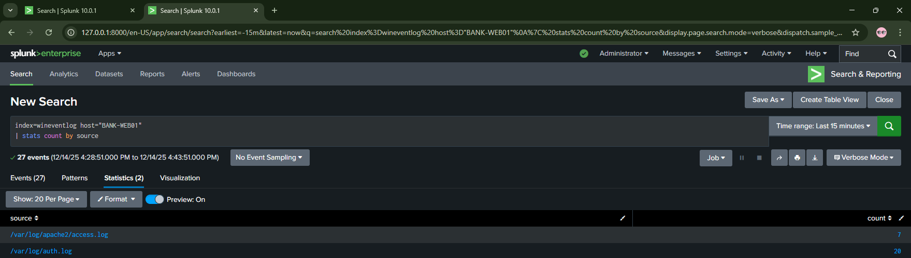

# Day 06 - Domain Controller & Ubuntu Web Server Log Onboarding

## 🎯 Objective
Onboard BANK-DC01 (Domain Controller) and BANK-WEB01 (Ubuntu Web Server) to Splunk for centralized log monitoring, completing the core infrastructure log collection across Windows and Linux environments.

## 🏦 Banking SOC Context
Real banks monitor Domain Controllers 24/7 for unauthorized user creation and privilege escalation, while web server logs detect SQL injection and brute force attacks on online banking portals—both critical for comprehensive threat detection.

---

## 📋 Part A: Domain Controller Log Onboarding

### Task 1: Install Splunk Universal Forwarder on BANK-DC01

**What We Did:**
- Shut down BANK-EMP01 to save RAM (16GB constraint)
- Started BANK-DC01
- Accessed splunkforwarder installer from shared folder (Z:\tools\)
- Installed Splunk UF with same configuration as BANK-EMP01

**Commands/Configuration:**

**Step 1 - Access Installer:**
- On BANK-DC01
- Navigate to: Z:\tools\
- Double-click: splunkforwarder-\<version\>-x64-release.msi

**Step 2 - Installation Wizard Settings:**
- Username: **admin**
- Password: [same as other installations]
- Deployment Server: **[blank]**
- Receiving Indexer: **192.168.56.1:9997**

**Step 3 - Verify Installation:**
```cmd
# Verify service running
sc query SplunkForwarder

# Expected output:
# SERVICE_NAME: SplunkForwarder
# STATE              : 4  RUNNING
#         (STOPPABLE, NOT_PAUSABLE, ACCEPTS_SHUTDOWN)
```

**Result:**
- Splunk Universal Forwarder installed successfully on BANK-DC01
- Service running automatically
- Connected to receiving indexer at 192.168.56.1:9997

✅ **Task 1 Complete**

---

### Task 2: Configure Domain Controller Log Collection

**What We Did:**
- Edited inputs.conf to monitor Security, System, and Application logs
- Added renderXml = 1 for all inputs (learned from Day 5 Sysmon issue)
- Restarted SplunkForwarder service

**Commands/Configuration:**

**Step 1 - Edit inputs.conf:**
```cmd
# On BANK-DC01
# Edit file: C:\Program Files\SplunkUniversalForwarder\etc\system\local\inputs.conf
# (Notepad as Administrator)

notepad "C:\Program Files\SplunkUniversalForwarder\etc\system\local\inputs.conf"
```

**Step 2 - Add Configuration:**

Add this to inputs.conf:
```ini
[WinEventLog://Security]
disabled = 0
index = wineventlog
renderXml = 1

[WinEventLog://System]
disabled = 0
index = wineventlog
renderXml = 1

[WinEventLog://Application]
disabled = 0
index = wineventlog
renderXml = 1
```

Save file: Ctrl+S → Close Notepad

**Step 3 - Restart Service:**
```cmd
# Restart service
net stop SplunkForwarder
net start SplunkForwarder

# Expected output:
# The SplunkForwarder service is stopping.
# The SplunkForwarder service was stopped successfully.
# The SplunkForwarder service is starting.
# The SplunkForwarder service was started successfully.
```

**Result:**
- Service restarted successfully
- Configuration applied
- Domain Controller logs now forwarding to Splunk

✅ **Task 2 Complete**

---

### Task 3: Verify Domain Controller Logs in Splunk

**What We Did:**
- Searched for BANK-DC01 logs in Splunk Enterprise (Windows 11 host)
- Verified all 3 sources appearing
- Confirmed EventID 4624 (successful logon) visible

**Commands/Configuration:**

On Splunk Web (http://localhost:8000):

**Search Query:**
```spl
# Search for all DC logs
index=wineventlog host="BANK-DC01"
```

**Verify All Sources:**
```spl
# Verify all sources
index=wineventlog host="BANK-DC01"
| stats count by source
```

**Expected Results:**

All 3 sources confirmed:
- WinEventLog:Application (30 events)
- WinEventLog:Security (189 events)
- WinEventLog:System (63 events)

**Sample Event Verified:**
- EventID: 4624 (Successful logon)
- Host: BANK-DC01.banklab.local
- Source: WinEventLog:Security
- ✓ Domain Controller logs flowing successfully

**Result:**
- All Windows Event Log sources visible in Splunk
- Authentication events (Event 4624) confirmed
- Domain Controller fully onboarded for SOC monitoring

✅ **Task 3 Complete - Part A Finished**

---

## 📋 Part B: Ubuntu Web Server Log Onboarding

### Task 1: Install Apache Web Server

**What We Did:**
- Shut down BANK-DC01 to save RAM
- Started BANK-WEB01 (Ubuntu 24.02.2 LTS)
- Waited for automatic system updates to complete (unattended-upgr process)
- Installed Apache2 web server

**Commands/Configuration:**

**Step 1 - Wait for Automatic Updates:**
```bash
# On BANK-WEB01 Terminal

# Check for automatic updates running
ps aux | grep unattended-upgr

# Process 5595 was running - wait for it to complete
# If stuck, kill the process:
sudo kill -9 5595
```

**Step 2 - Update Package List:**
```bash
# Update package list
sudo apt update

# Expected output:
# Hit:1 http://archive.ubuntu.com/ubuntu jammy InRelease
# Reading package lists... Done
```

**Step 3 - Install Apache:**
```bash
# Install Apache
sudo apt install apache2 -y

# Expected output:
# Reading package lists... Done
# Building dependency tree... Done
# Setting up apache2...
# apache2.service - The Apache HTTP Server
```

**Step 4 - Verify Apache Running:**
```bash
# Verify Apache running
sudo systemctl status apache2

# Expected output:
# ● apache2.service - The Apache HTTP Server
#      Loaded: loaded (/lib/systemd/system/apache2.service; enabled)
#      Active: active (running) since Sat 2025-12-14 16:25:00 IST
```

**Step 5 - Test Web Server:**
```bash
# Test from command line
curl http://localhost

# Expected output:
# <!DOCTYPE html>
# <html>
# <body><h1>It works!</h1></body>
# </html>
```

Also tested in Firefox:
- URL: http://localhost
- URL: http://192.168.56.12
- Result: Apache default page ("It works!") visible ✓

**Result:**
- Apache2 web server installed successfully
- Service active and running
- Default page accessible at http://localhost and http://192.168.56.12
- Ready for log forwarding to Splunk

**Troubleshooting Note:**

Encountered "Could not get lock" error due to automatic Ubuntu updates running in background. Waited for process to complete, then killed stuck process 5595 before successfully installing Apache.

✅ **Task 1 Complete**

---

### Task 2: Download Splunk Universal Forwarder for Linux

**What We Did:**
- Downloaded Linux .deb package from Splunk website
- Selected correct version: 64-bit (NOT ARM) for Ubuntu
- Verified download completed

**Commands/Configuration:**

**Step 1 - Download via Firefox:**

On BANK-WEB01:
- Open Firefox
- Navigate to: https://www.splunk.com/en_us/download/universal-forwarder.html
- Select: **Linux 64-bit .deb** (68.01 MB)
- File: splunkforwarder-10.0.2-e2d18b4767e9-linux-amd64.deb
- Save to: ~/Downloads/

**Step 2 - Verify Download:**
```bash
# Verify download
ls -lh ~/Downloads/splunk*.deb

# Expected output:
# -rw-r--r-- 1 vboxuser vboxuser 68M Dec 14 16:25 splunkforwarder-10.0.2-e2d18b4767e9-linux-amd64.deb
```

**Result:**
- Splunk Universal Forwarder for Linux downloaded successfully
- File size verified: 68 MB
- Ready for installation

✅ **Task 2 Complete**

---

### Task 3: Install Splunk Universal Forwarder on Ubuntu

**What We Did:**
- Installed .deb package using dpkg
- Started Splunk and created admin credentials
- Enabled boot-start for automatic service startup

**Commands/Configuration:**

**Step 1 - Navigate to Downloads:**
```bash
# On BANK-WEB01

# Navigate to Downloads
cd ~/Downloads
```

**Step 2 - Install the Package:**
```bash
# Install the package
sudo dpkg -i splunkforwarder-*.deb

# Expected output:
# Selecting previously unselected package splunkforwarder.
# Unpacking splunkforwarder...
# Setting up splunkforwarder...
# complete
```

**Step 3 - Start Splunk and Accept License:**
```bash
# Start Splunk and accept license
sudo /opt/splunkforwarder/bin/splunk start --accept-license

# Expected output:
# Splunk> All bathed in milk. All flesh is grass.
# 
# Checking prerequisites...
# ...
# All preliminary checks passed.
# 
# Starting splunk server daemon (splunkd)...
# Done.
```

**Step 4 - Create Admin Credentials:**

When prompted:
- Username: **admin**
- Password: [same as Windows installations]
- Confirm password: [re-enter]

**Step 5 - Enable Boot-Start:**
```bash
# Enable boot-start
sudo /opt/splunkforwarder/bin/splunk enable boot-start

# Expected output:
# Init script installed at /etc/init.d/splunk.
# Init script is configured to run at boot.
```

**Result:**
- Splunk Universal Forwarder installed successfully on Ubuntu
- Service running with admin credentials configured
- Configured to start automatically at boot

✅ **Task 3 Complete**

---

### Task 4: Configure Log Forwarding and Inputs

**What We Did:**
- Added Splunk Enterprise host as receiving indexer
- Created inputs.conf to monitor auth.log and Apache logs
- Restarted Splunk UF

**Commands/Configuration:**

**Step 1 - Add Forward-Server:**
```bash
# On BANK-WEB01

# Add forward-server
sudo /opt/splunkforwarder/bin/splunk add forward-server 192.168.56.1:9997

# Expected output:
# Added forwarding to: 192.168.56.1:9997
```

**Step 2 - Create inputs.conf:**
```bash
# Create inputs.conf
sudo nano /opt/splunkforwarder/etc/system/local/inputs.conf
```

**Step 3 - Add Configuration:**

Add this to inputs.conf:
```ini
[monitor:///var/log/auth.log]
disabled = false
index = wineventlog
sourcetype = linux_secure

[monitor:///var/log/apache2/access.log]
disabled = false
index = wineventlog
sourcetype = access_combined

[monitor:///var/log/apache2/error.log]
disabled = false
index = wineventlog
sourcetype = apache_error
```

Save file: Ctrl+O, Enter, Ctrl+X

**Step 4 - Restart Splunk:**
```bash
# Restart Splunk
sudo /opt/splunkforwarder/bin/splunk restart

# Expected output:
# Stopping splunkd...
# Shutting down. Please wait...
# Done.
# 
# Splunk> Take the sh out of IT.
# 
# Checking prerequisites...
# ...
# Starting splunk server daemon (splunkd)...
# Done.
```

**Result:**
- Forward-server configured: 192.168.56.1:9997
- Three log sources configured: auth.log, Apache access.log, Apache error.log
- Splunk UF restarted successfully
- Logs now forwarding to Splunk Enterprise

✅ **Task 4 Complete**

---

### Task 5: Generate Web Traffic and Verify Logs

**What We Did:**
- Generated HTTP requests to create Apache access logs
- Generated failed requests (404 errors) for error logs
- Verified all 3 log sources in Splunk

**Commands/Configuration:**

**Step 1 - Generate Web Traffic in Firefox:**

On BANK-WEB01:
- http://localhost
- http://localhost/test
- http://localhost/admin
- http://192.168.56.12

**Step 2 - Generate Command-Line Traffic:**
```bash
# On BANK-WEB01

# Generate web traffic
curl http://localhost
curl http://localhost/test
curl http://localhost/login

# Wait 1 minute for logs to flow to Splunk
```

**Step 3 - Verify in Splunk:**

On Splunk Web (Windows 11 host) - http://localhost:8000:

**Search for Ubuntu Logs:**
```spl
# Search for Ubuntu logs
index=wineventlog host="BANK-WEB01"
```

**Verify All Sources:**
```spl
# Verify all sources
index=wineventlog host="BANK-WEB01"
| stats count by source
```

**Expected Results:**

All 3 sources confirmed:
- /var/log/auth.log (22 events)
- /var/log/apache2/access.log (multiple events)
- /var/log/apache2/error.log (multiple events)

**Sample auth.log Event:**
```
2025-12-14T16:36:50.153434+05:30 BANK-WEB01 sudo: pam_unix(sudo:session): session closed for user root
```

**Result:**
- All three log sources flowing to Splunk
- Apache access logs capturing web requests
- Apache error logs capturing 404 errors
- Auth logs capturing sudo and SSH activity
- Ubuntu web server fully onboarded for SOC monitoring



✅ **Task 5 Complete - Part B Finished**

---

## 🛠️ Troubleshooting

### Problem 1: Ubuntu Package Manager Lock

**Error Message/Symptom:**
```
E: Could not get lock /var/lib/apt/lists/lock. It is held by process 4481 (apt-get)
N: Be aware that removing the lock file is not a solution and may break your system.
E: Unable to lock directory /var/lib/apt/lists/
```

**Root Cause:**

Ubuntu automatic updates (unattended-upgrades process) were running in the background, holding the package manager lock.

**Solution Steps:**

1. Checked running process:
```bash
ps aux | grep -i apt
# Found: process 5595 (unattended-upgr)
```

2. Waited 2-3 minutes for automatic updates to complete

3. Process stuck, so killed it:
```bash
sudo kill -9 5595
```

4. Retried apt commands:
```bash
sudo apt update
sudo apt install apache2 -y
```

**Verification:**

Apache installed successfully after killing the stuck process.

✅ **Issue Resolved**

---

### Problem 2: Apache Not Showing in Firefox

**Error Message/Symptom:**

Typing "localhost" in Firefox showed default Firefox start page instead of Apache "It works!" page.

**Root Cause:**

Firefox was treating "localhost" as a search term instead of a URL when typed without http:// prefix.

**Solution Steps:**

1. Used full URL with protocol:
```
http://localhost
```

2. Alternative: Used IP address directly:
```
http://192.168.56.12
```

**Verification:**

Apache default page ("It works!") displayed correctly when using full http:// URL.

✅ **Issue Resolved**

---

## 🔧 Technical Details

**VMs Used:**
- **BANK-DC01**: Windows Server 2019 - Splunk UF installed, forwarding Security, System, Application logs
- **BANK-WEB01**: Ubuntu 24.02.2 LTS - Apache web server + Splunk UF, forwarding auth.log and Apache logs

**Tools/Technologies:**
- **Splunk Universal Forwarder**: Windows and Linux versions - Log collection agents
- **Apache2**: Open-source web server for Ubuntu
- **inputs.conf**: Configuration file for log sources
- **Windows Event Logs**: Security, System, Application logs from Domain Controller
- **Linux System Logs**: auth.log, Apache access.log, Apache error.log

**Network Configuration:**
- Host IP: 192.168.56.1
- BANK-DC01 IP: 192.168.56.10 (Domain Controller)
- BANK-WEB01 IP: 192.168.56.12 (Ubuntu Web Server)
- Splunk Receiving Port: 9997

**Splunk Configuration:**

| Component              | Value                                | Purpose                              |
|------------------------|--------------------------------------|--------------------------------------|
| Index Name             | wineventlog                          | Stores ALL logs (Windows and Linux)  |
| Receiving Port         | 9997                                 | Listens for forwarder connections    |
| DC Sources             | Security, System, Application        | Domain Controller event logs         |
| Ubuntu Sources         | auth.log, access.log, error.log      | Linux system and web server logs     |

**Files Created/Modified:**

**BANK-DC01:**

| File Path                                                                    | Purpose                           |
|------------------------------------------------------------------------------|-----------------------------------|
| C:\Program Files\SplunkUniversalForwarder\etc\system\local\inputs.conf      | DC log monitoring configuration   |

**BANK-WEB01:**

| File Path                                                  | Purpose                            |
|------------------------------------------------------------|------------------------------------|
| /opt/splunkforwarder/etc/system/local/inputs.conf         | Linux log monitoring configuration |
| /etc/apache2/                                              | Apache installation directory      |
| /var/www/html/                                             | Web root directory                 |

---

## 🔑 Key Data Created

**CRITICAL - Future threads will need these exact values:**

### Network Configuration
- **Host IP**: 192.168.56.1
- **BANK-DC01 IP**: 192.168.56.10 (Domain Controller)
- **BANK-WEB01 IP**: 192.168.56.12 (Ubuntu Web Server)

### Active Directory (BANK-DC01)
- **Domain**: banklab.local
- **Users created** (from Day 3): teller1, teller2, manager1, itadmin, auditor, fraudanalyst
- **All user passwords**: Bank@123

### Splunk Configuration
- **Index name**: wineventlog (used for ALL logs - Windows and Linux)
- **Forwarder port**: 9997
- **Receiving host**: 192.168.56.1

### Domain Controller Sources
- WinEventLog:Security
- WinEventLog:System
- WinEventLog:Application

### Ubuntu Web Server Sources
- /var/log/auth.log (sourcetype: linux_secure)
- /var/log/apache2/access.log (sourcetype: access_combined)
- /var/log/apache2/error.log (sourcetype: apache_error)

### SPL Queries Created

**Query 1 - View all DC logs:**
```spl
index=wineventlog host="BANK-DC01"
```

**Query 2 - View DC logs by source:**
```spl
index=wineventlog host="BANK-DC01"
| stats count by source
```

**Query 3 - View all Ubuntu logs:**
```spl
index=wineventlog host="BANK-WEB01"
```

**Query 4 - View Ubuntu logs by source:**
```spl
index=wineventlog host="BANK-WEB01"
| stats count by source
```

**Query 5 - View only Apache access logs:**
```spl
index=wineventlog host="BANK-WEB01" source="/var/log/apache2/access.log"
```

**Query 6 - View SSH login attempts:**
```spl
index=wineventlog host="BANK-WEB01" source="/var/log/auth.log" "sudo"
```

### Log Event Counts
**BANK-DC01:**
- WinEventLog:Application: 30 events
- WinEventLog:Security: 189 events
- WinEventLog:System: 63 events

**BANK-WEB01:**
- /var/log/auth.log: 22 events
- /var/log/apache2/access.log: Multiple events
- /var/log/apache2/error.log: Multiple events

---
